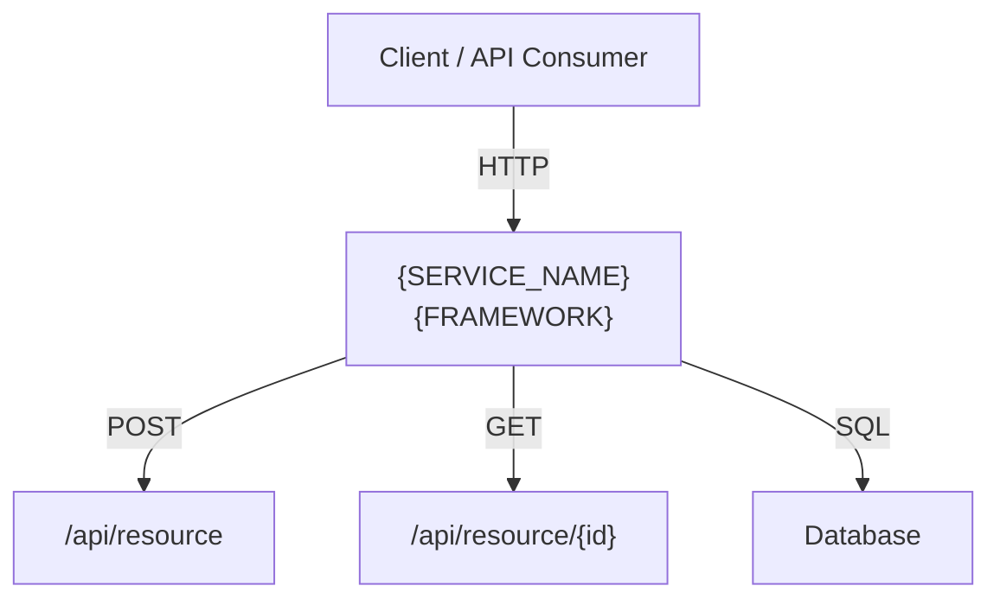

# Output Templates

Templates for documentation artifacts generated by the `generate-documentation` skill.

## Release Notes Template

```markdown
# Release Notes — {ISSUE_KEY}

## Summary

- **Issue:** {ISSUE_KEY}
- **Title:** {ISSUE_SUMMARY}
- **Workflow:** `{WORKFLOW_ID}`
- **Date:** {YYYY-MM-DD}
- **Branch:** `workflow/{WORKFLOW_ID}/{ISSUE_KEY_LOWER}`

## Changes

### Files Modified

- `path/to/file.py` — Brief description of change

### New Features

- Description of each new feature or capability

### Modified

- Description of each modification to existing behavior

## API Changes

| Method | Endpoint | Description | Status |
|--------|----------|-------------|--------|
| POST | `/api/resource` | Create a resource | New |
| GET | `/api/resource/{id}` | Updated response format | Modified |

## Test Results

| Metric | Value |
|--------|-------|
| Tests passed | {N} |
| Tests failed | {N} |
| Coverage (new code) | {X}% |

## Security

- Static analysis: {N} findings ({N} HIGH/CRITICAL)
- Dependency scan: {N} known CVEs

## Rollback

```bash
# Revert via MR or:
git revert workflow/{WORKFLOW_ID}/{ISSUE_KEY_LOWER}
```
```

## API Changelog Template

Use [Keep a Changelog](https://keepachangelog.com/) format.

```markdown
# API Changelog

All notable API changes are documented here.

## [{ISSUE_KEY}] — {YYYY-MM-DD}

### Added
- `POST /api/resource` — Create a new resource
- `GET /api/resource/{id}` — Retrieve resource by ID

### Changed
- `PUT /api/resource/{id}` — Now requires `version` field in body

### Deprecated
- `GET /api/old-endpoint` — Use `/api/new-endpoint` instead

### Removed
- `DELETE /api/legacy` — Removed in this release
```

When appending to an existing CHANGELOG.md, insert the new entry at the top
(below the file header), so the most recent change appears first.

## Architecture Diagram Template

```markdown
# Architecture — {SERVICE_NAME}

## Component Diagram



## Endpoint Summary

| Method | Path | Description |
|--------|------|-------------|
| POST | `/api/resource` | Create resource |
| GET | `/api/resource/{id}` | Get resource by ID |
```

Keep Mermaid diagrams under 15 nodes. If the service has more components,
split into multiple diagrams (e.g., one per domain area).
