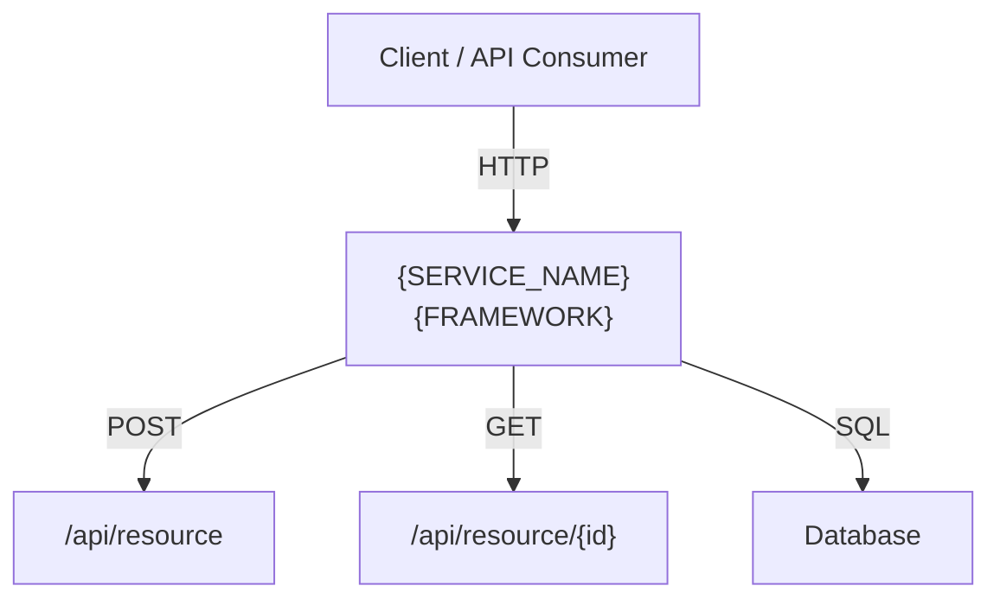

# Output Templates

Templates for documentation artifacts generated by the `generate-documentation` skill.

## Release Notes Template

```markdown
# Release Notes — {ISSUE_KEY}

## Summary

- **Issue:** {ISSUE_KEY}
- **Title:** {ISSUE_SUMMARY}
- **Workflow:** `{WORKFLOW_ID}`
- **Date:** {YYYY-MM-DD}
- **Branch:** `workflow/{WORKFLOW_ID}/{ISSUE_KEY_LOWER}`

## Changes

### Files Modified

- `path/to/file.py` — Brief description of change

### New Features

- Description of each new feature or capability

### Modified

- Description of each modification to existing behavior

## API Changes

| Method | Endpoint | Description | Status |
|--------|----------|-------------|--------|
| POST | `/api/resource` | Create a resource | New |
| GET | `/api/resource/{id}` | Updated response format | Modified |

## Test Results

| Metric | Value |
|--------|-------|
| Tests passed | {N} |
| Tests failed | {N} |
| Coverage (new code) | {X}% |

## Security

- Static analysis: {N} findings ({N} HIGH/CRITICAL)
- Dependency scan: {N} known CVEs

## Rollback

```bash
# Revert via MR or:
git revert workflow/{WORKFLOW_ID}/{ISSUE_KEY_LOWER}
```
```

## API Changelog Template

Use [Keep a Changelog](https://keepachangelog.com/) format.

```markdown
# API Changelog

All notable API changes are documented here.

## [{ISSUE_KEY}] — {YYYY-MM-DD}

### Added
- `POST /api/resource` — Create a new resource
- `GET /api/resource/{id}` — Retrieve resource by ID

### Changed
- `PUT /api/resource/{id}` — Now requires `version` field in body

### Deprecated
- `GET /api/old-endpoint` — Use `/api/new-endpoint` instead

### Removed
- `DELETE /api/legacy` — Removed in this release
```

When appending to an existing CHANGELOG.md, insert the new entry at the top
(below the file header), so the most recent change appears first.

## Architecture Diagram Template

```markdown
# Architecture — {SERVICE_NAME}

## Component Diagram



## Endpoint Summary

| Method | Path | Description |
|--------|------|-------------|
| POST | `/api/resource` | Create resource |
| GET | `/api/resource/{id}` | Get resource by ID |
```

Keep Mermaid diagrams under 15 nodes. If the service has more components,
split into multiple diagrams (e.g., one per domain area).


## WF1 Summary Report Template

```markdown
# ✅ WF1 Complete — {FEATURE_SUMMARY}

{Brief description of what was done: implemented, validated, or no changes needed.}

## Checkpoint Results

| Checkpoint | Status | Details |
|---|---|---|
| Code Review | ✅ PASSED / ❌ FAILED | {correctness, conventions, security findings} |
| Security Scan | ✅ PASSED / ❌ FAILED | {N} code findings, {N} dependency vulnerabilities |
| Test Coverage | ✅ PASSED / ❌ FAILED | {N}/{N} tests pass, {X}% coverage on new/modified code |

## What Was Done

{Description of the feature or change — endpoints added/modified, models created, logic implemented. Include request/response examples if REST endpoints are involved.}

## Files

{List each file created or modified with a brief description. If no changes were needed, note "no changes — all pre-existing".}

- `path/to/file.py` — description of change
- `tests/test_feature.py` — {N} tests

## 💰 Workflow Cost Summary

**Workflow:** {WORKFLOW_ID}
**Token counting:** {recorded / estimated}

| Dimension | Quantity | Unit Price | Cost |
|---|---|---|---|
| LLM Input Tokens | {N} tokens | $0.003 / 1K tokens | ${cost} |
| LLM Output Tokens | {N} tokens | $0.015 / 1K tokens | ${cost} |
| Compute Time | {Xm Ys} | $0.00005 / sec | ${cost} |
| MCP Tool Calls | {N} | $0.0001 / call | ${cost} |
| Checkpoints | {N} | $0.001 / checkpoint | ${cost} |
| **Total** | | | **${total}** |
```

Place the summary report at `docs/wf1-summary-{ISSUE_KEY}.md` in the target service.
This is the same structure the agent uses in its final chat response (steps 11–12).
Populate all fields from checkpoint results, test output, security scan, and finops cost data.
Use ✅ PASSED / ❌ FAILED for checkpoint status. If a section has no data, show `0` or `N/A`.
