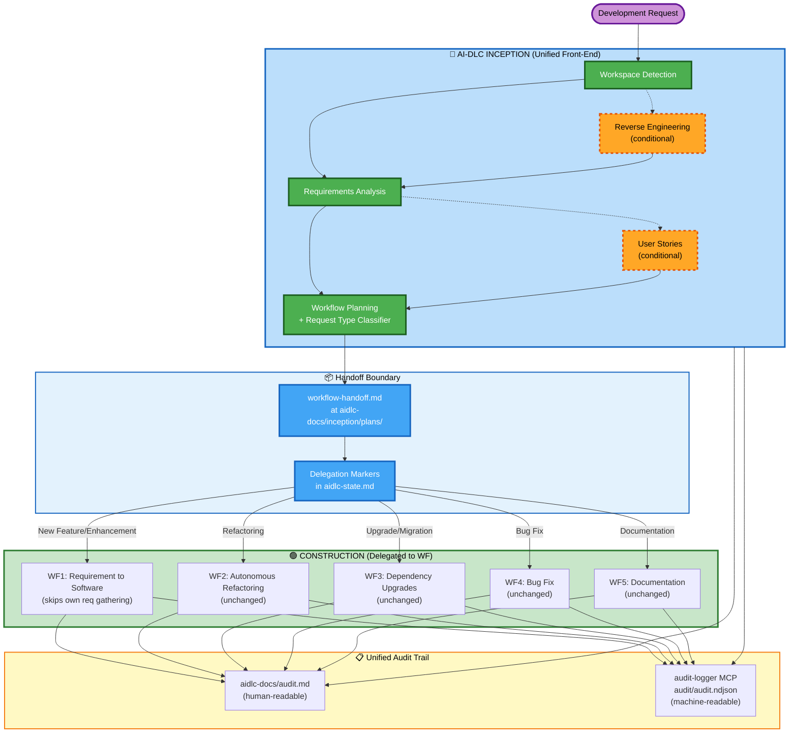

# Design Document: AI-DLC Workflow Integration

## Overview

This design describes how the AI-DLC three-phase adaptive workflow (INCEPTION → CONSTRUCTION → OPERATIONS) integrates with the existing WF1–WF5 specialized workflows. The core idea: AI-DLC INCEPTION becomes the unified front-end for all development requests, and the Workflow Planning stage within INCEPTION selects and delegates to the appropriate WF1–WF5 workflow for CONSTRUCTION.

The integration solves three problems:
1. **Duplication**: WF1's requirements gathering overlaps heavily with INCEPTION's Requirements Analysis. The integrated flow eliminates this by having WF1 consume INCEPTION artifacts directly, targeting ~60% reduction in duplicated planning stages.
2. **Fragmented audit**: AI-DLC and WF executions currently produce separate audit trails. The integration unifies them via dual-write to `aidlc-docs/audit.md` and the audit-logger MCP.
3. **Manual workflow selection**: Developers currently choose WF1–WF5 manually. The Request Type Classifier in Workflow Planning automates this selection.

Key design decisions:
- **WF1 is modified** to skip its own requirements gathering and consume the Handoff Artifact from INCEPTION.
- **WF2–WF5 are unchanged internally** — they receive the Handoff Artifact as additional context but their internal stages remain intact.
- **Delegation markers** in `aidlc-state.md` track which CONSTRUCTION stages are handled by WFs vs. AI-DLC directly.
- **CI pipeline structure is preserved** — the 4-stage `.gitlab-ci-workflow.yml` pipeline (validate → execute-workflow → checkpoint-gates → finalize) remains unchanged; only the `execute-workflow` prompt changes to invoke INCEPTION first.
- **CI autonomous mode** auto-approves INCEPTION gates in `--no-interactive` mode, selecting the most secure/compliant option.

## Architecture

The integrated system has three layers: the INCEPTION front-end, the handoff boundary, and the WF CONSTRUCTION back-end.



### CI Pipeline Integration

The existing 4-stage GitLab CI pipeline remains structurally unchanged. The only modification is the `execute-workflow` stage prompt, which now instructs `kiro-cli` to run AI-DLC INCEPTION first, then delegate to the resolved WF:

```
Before (current):
  kiro-cli chat --no-interactive -a "Execute workflow ${WORKFLOW} for Jira issue ${JIRA_ISSUE_KEY}..."

After (integrated):
  kiro-cli chat --no-interactive -a "Execute AI-DLC INCEPTION for Jira issue ${JIRA_ISSUE_KEY},
  then delegate CONSTRUCTION to the selected WF (default: ${WORKFLOW})..."
```

The `validate` stage still resolves the workflow from `config/jira-project-mappings.yml` and passes it as a hint. The Request Type Classifier may confirm or override this hint based on INCEPTION analysis.

## Components and Interfaces

### 1. Request Type Classifier

Located within the Workflow Planning stage (`inception/workflow-planning.md`). Not a separate code module — it's a decision logic block executed by the AI model during Workflow Planning.

**Input**: User request text, requirements artifacts from `aidlc-docs/inception/requirements/requirements.md`, reverse engineering context from `aidlc-docs/inception/reverse-engineering/` (if brownfield).

**Output**: Classification result written into the Handoff Artifact:
- `request_type`: One of `"New Feature"`, `"Enhancement"`, `"Refactoring"`, `"Upgrade"`, `"Migration"`, `"Bug Fix"`, `"Documentation"`
- `selected_wf`: One of `"wf1-requirement-to-software"`, `"wf2-autonomous-refactoring"`, `"wf3-dependency-upgrades"`, `"wf4-bug-fix"`, `"wf5-documentation"`
- `confidence`: `"high"`, `"medium"`, `"low"`
- `rationale`: Free-text explanation of classification reasoning

**Classification rules**:
| Request Type | Selected WF |
|---|---|
| New Feature, Enhancement | WF1 |
| Refactoring | WF2 |
| Upgrade, Migration | WF3 |
| Bug Fix | WF4 |
| Documentation | WF5 |

**User override**: After classification, the user is presented with the selection for approval. If overridden, the override and rationale are recorded in both the Handoff Artifact and the Unified Audit Trail.

### 2. Handoff Artifact Generator

Produces the `aidlc-docs/inception/plans/workflow-handoff.md` file at the end of Workflow Planning. This is the bridge between INCEPTION and CONSTRUCTION.

**Interface**:
- Reads: All INCEPTION stage outputs (requirements, reverse engineering, user stories, workflow plan)
- Writes: `aidlc-docs/inception/plans/workflow-handoff.md`

### 3. WF1 Artifact Consumer (Modified WF1 Entry Point)

The WF1 skill (`wf1-requirement-to-software/SKILL.md`) is modified to detect and consume the Handoff Artifact. When the Handoff Artifact exists:
- Step 1 (Parse Requirement) loads requirements from the Handoff Artifact reference path instead of raw user input
- Step 2 (Create Kiro Spec) skips `requirements.md` generation and uses `aidlc-docs/inception/requirements/requirements.md` as the authoritative source
- Steps 3–10 proceed unchanged

**Interface**:
- Reads: `aidlc-docs/inception/plans/workflow-handoff.md`, referenced INCEPTION artifacts
- Writes: `design.md`, `tasks.md`, implementation code (unchanged outputs)

### 4. WF2–WF5 Context Loader

WF2–WF5 skills are not modified. The Handoff Artifact is loaded as additional context at the start of each WF's execution. The WF's internal stages process it as supplementary information alongside their normal inputs.

**Interface**:
- Reads: `aidlc-docs/inception/plans/workflow-handoff.md` (optional — WFs function without it)
- Internal processing: Unchanged

### 5. Delegation Marker Manager

Logic within the AI-DLC core workflow that applies delegation markers to CONSTRUCTION stages in `aidlc-state.md` based on the selected WF.

**Interface**:
- Reads: Selected WF from Handoff Artifact
- Writes: Delegation markers in `aidlc-state.md`, audit entries in both audit destinations

**Delegation mapping**:
| Selected WF | Delegated CONSTRUCTION Stages |
|---|---|
| WF1 | Functional Design, NFR Requirements, NFR Design, Infrastructure Design, Code Generation |
| WF2 | Code Generation, Build and Test |
| WF3 | Code Generation, Build and Test |
| WF4 | Code Generation, Build and Test |
| WF5 | Code Generation |

### 6. Unified Audit Writer

A dual-write pattern used by all components. Every audit-worthy event is written to both:
1. `aidlc-docs/audit.md` — human-readable markdown, appended with ISO 8601 timestamps
2. `audit-logger MCP` — machine-readable NDJSON via `log_event`, `log_interaction`, or `log_checkpoint`

The audit-logger MCP record schema is extended with a `phase` field (`"INCEPTION"` or `"CONSTRUCTION"`) in the `details` dict of `log_event` calls.

### 7. CI Auto-Approval Controller

Active only when `--no-interactive` flag is detected. Intercepts INCEPTION approval gates and auto-selects the most secure/compliant option.

**Interface**:
- Detects: `--no-interactive` flag on `kiro-cli` invocation
- Reads: Gate options, `security-rules.md`, `coding-standards.md` steering rules
- Writes: Auto-approval decisions to Unified Audit Trail
- Halts: If blocking compliance issues are detected (unresolved security findings, hardcoded credentials, missing input validation)

**Auto-approved gates**: Requirements Analysis completion, User Stories completion, Workflow Planning completion (including WF selection), Application Design completion, Units Generation completion.

**Never auto-approved**: Checkpoint gates (test coverage, security scan, code review) — these are deterministic quality gates that always execute regardless of mode.

### 8. Session Continuity Handler

Uses existing `aidlc-state.md` and `common/session-continuity.md` guidance. Extended to handle the integrated workflow:
- If `aidlc-state.md` shows INCEPTION complete + Handoff Artifact exists → resume at CONSTRUCTION
- If `aidlc-state.md` shows CONSTRUCTION in progress via a specific WF → resume that WF from its last checkpoint

## Data Models

### Handoff Artifact (`aidlc-docs/inception/plans/workflow-handoff.md`)

```markdown
# Workflow Handoff Artifact

## Selected Workflow
- **Workflow**: {wf_identifier} (e.g., wf1-requirement-to-software)
- **Request Type**: {request_type} (e.g., New Feature)
- **Confidence**: {high|medium|low}
- **Classification Rationale**: {free-text rationale}

## Intent Analysis Summary
- **Request Clarity**: {Clear|Vague|Incomplete}
- **Scope Estimate**: {Single File|Single Component|Multiple Components|System-wide|Cross-system}
- **Complexity Estimate**: {Trivial|Simple|Moderate|Complex}

## Requirements Reference
- **Full Requirements**: aidlc-docs/inception/requirements/requirements.md
- **Verification Questions**: aidlc-docs/inception/requirements/requirement-verification-questions.md

## Reverse Engineering References (if available)
- **Architecture**: aidlc-docs/inception/reverse-engineering/architecture.md
- **Code Structure**: aidlc-docs/inception/reverse-engineering/code-structure.md
- **Component Inventory**: aidlc-docs/inception/reverse-engineering/component-inventory.md
- **Technology Stack**: aidlc-docs/inception/reverse-engineering/technology-stack.md
- **API Documentation**: aidlc-docs/inception/reverse-engineering/api-documentation.md

## INCEPTION Stages Executed
| Stage | Status | Completed At |
|---|---|---|
| Workspace Detection | Completed | {ISO 8601 timestamp} |
| Reverse Engineering | {Completed|Skipped} | {timestamp or N/A} |
| Requirements Analysis | Completed | {ISO 8601 timestamp} |
| User Stories | {Completed|Skipped} | {timestamp or N/A} |
| Workflow Planning | Completed | {ISO 8601 timestamp} |

## Delegated CONSTRUCTION Stages
| Stage | Delegation Status |
|---|---|
| Functional Design | {delegated to WF1|not delegated} |
| NFR Requirements | {delegated to WF1|not delegated} |
| NFR Design | {delegated to WF1|not delegated} |
| Infrastructure Design | {delegated to WF1|not delegated} |
| Code Generation | delegated to {wf_identifier} |
| Build and Test | {delegated to {wf_identifier}|not delegated} |

## User Override (if applicable)
- **Original Selection**: {original_wf}
- **Override To**: {overridden_wf}
- **Override Rationale**: {user-provided rationale}
```

### AIDLC State Extensions (`aidlc-state.md`)

The existing `aidlc-state.md` format is extended with two new sections:

```markdown
## Workflow Integration
- **Selected WF**: {wf_identifier}
- **Request Type**: {classification}
- **Handoff Timestamp**: {ISO 8601}
- **Integration Status**: {INCEPTION in progress|Handoff pending|CONSTRUCTION in progress via {WF}|Complete}

## Stage Progress
### 🔵 INCEPTION PHASE
- [x] Workspace Detection - COMPLETED {timestamp}
- [x] Reverse Engineering - COMPLETED {timestamp}
- [x] Requirements Analysis - COMPLETED {timestamp}
- [-] User Stories - SKIPPED
- [x] Workflow Planning - COMPLETED {timestamp}

### 🟢 CONSTRUCTION PHASE
- [D] Functional Design - delegated to wf1-requirement-to-software
- [D] NFR Requirements - delegated to wf1-requirement-to-software
- [D] NFR Design - delegated to wf1-requirement-to-software
- [D] Infrastructure Design - delegated to wf1-requirement-to-software
- [D] Code Generation - delegated to wf1-requirement-to-software
- [ ] Build and Test
```

Stage status markers:
- `[x]` — completed (by AI-DLC or by WF)
- `[ ]` — pending
- `[-]` — skipped
- `[D]` — delegated to a WF (not yet completed)

When a WF completes a delegated stage, the marker changes from `[D]` to `[x]`:
```
- [x] Functional Design - completed by wf1-requirement-to-software
```

### Unified Audit Trail Entry Format

**Human-readable (`aidlc-docs/audit.md`)**:
```markdown
## {Stage Name or Event Type}
**Timestamp**: {ISO 8601}
**Phase**: {INCEPTION|CONSTRUCTION}
**User Input**: "{raw input}"
**AI Response**: "{response or action}"
**Context**: {stage, action, or decision}

---
```

**Machine-readable (audit-logger MCP `log_event`)**:
```json
{
  "workflow_id": "aidlc-wf1-integration",
  "event_type": "handoff",
  "initiator": "ai-dlc",
  "details": {
    "phase": "INCEPTION",
    "selected_wf": "wf1-requirement-to-software",
    "request_type": "New Feature",
    "classification_rationale": "...",
    "handoff_artifact_path": "aidlc-docs/inception/plans/workflow-handoff.md"
  }
}
```

### CI Auto-Approval Audit Record

```json
{
  "workflow_id": "aidlc-ci-auto",
  "event_type": "auto_approval",
  "initiator": "kiro-cli-ci",
  "details": {
    "phase": "INCEPTION",
    "gate_name": "Requirements Analysis completion",
    "selected_option": "approve",
    "rationale": "All requirements complete, no security findings, no missing input validation",
    "compliance_checks": ["security-rules.md", "coding-standards.md"],
    "blocking_issues": 0
  }
}
```


## Correctness Properties

*A property is a characteristic or behavior that should hold true across all valid executions of a system — essentially, a formal statement about what the system should do. Properties serve as the bridge between human-readable specifications and machine-verifiable correctness guarantees.*

### Property 1: Request type classification maps to correct WF

*For any* request type classification, the selected WF must match the defined mapping: "New Feature" or "Enhancement" → WF1, "Refactoring" → WF2, "Upgrade" or "Migration" → WF3, "Bug Fix" → WF4, "Documentation" → WF5. No other mappings are valid.

**Validates: Requirements 2.2, 2.3, 2.4, 2.5, 2.6**

### Property 2: Delegation marker mapping is correct per WF

*For any* selected WF, the set of CONSTRUCTION stages marked with delegation markers must exactly match the defined mapping: WF1 → {Functional Design, NFR Requirements, NFR Design, Infrastructure Design, Code Generation}, WF2 → {Code Generation, Build and Test}, WF3 → {Code Generation, Build and Test}, WF4 → {Code Generation, Build and Test}, WF5 → {Code Generation}. No extra or missing delegations.

**Validates: Requirements 10.1, 10.2, 10.3, 10.4, 10.5**

### Property 3: Coverage threshold is correct per WF

*For any* selected WF, the coverage threshold applied by the checkpoint framework must match: WF1 → 80%, WF2 → 80%, WF3 → 70%, WF4 → 90%, WF5 → None (skipped). The `evaluate_coverage_gate` function must receive the correct threshold.

**Validates: Requirements 7.2, 7.3, 7.4, 7.5, 7.6**

### Property 4: Handoff Artifact contains all required sections

*For any* completed Workflow Planning stage, the Handoff Artifact at `aidlc-docs/inception/plans/workflow-handoff.md` must contain: selected WF identifier, request type classification with rationale, confidence level, intent analysis summary (request clarity, scope estimate, complexity estimate), reference path to the full requirements document, list of INCEPTION stages executed with completion timestamps, and list of CONSTRUCTION stages delegated to the selected WF.

**Validates: Requirements 1.2, 2.7, 5.2**

### Property 5: Handoff Artifact uses references, not duplicates

*For any* Handoff Artifact, the requirements section must contain a file path reference to `aidlc-docs/inception/requirements/requirements.md` (not the full requirements content), and the reverse engineering section (when present) must contain file path references to `aidlc-docs/inception/reverse-engineering/` artifacts (not their full content).

**Validates: Requirements 5.3, 5.4**

### Property 6: Delegated stages are skipped by AI-DLC

*For any* CONSTRUCTION stage marked with a delegation marker `[D]` in `aidlc-state.md`, AI-DLC must not execute that stage directly. The stage must only be executed by the delegated WF. The delegation must be recorded in both `aidlc-docs/audit.md` and via the audit-logger MCP.

**Validates: Requirements 3.6, 10.6, 10.7**

### Property 7: WF1 skips requirements gathering when Handoff Artifact exists

*For any* WF1 execution where a valid Handoff Artifact exists at `aidlc-docs/inception/plans/workflow-handoff.md`, WF1 must skip its own requirements gathering step (Step 1 Parse Requirement from raw input) and its own `requirements.md` generation (Step 2 Create Kiro Spec requirements), consuming the INCEPTION requirements from the Handoff Artifact reference path instead.

**Validates: Requirements 3.1, 3.2**

### Property 8: Unified audit dual-write consistency

*For any* audit-worthy event (INCEPTION stage completion, handoff, CONSTRUCTION checkpoint, delegation), the event must be written to both `aidlc-docs/audit.md` (human-readable, ISO 8601 timestamps) and via the audit-logger MCP (machine-readable NDJSON). The MCP record must include a `phase` field with value `"INCEPTION"` or `"CONSTRUCTION"`.

**Validates: Requirements 6.1, 6.2, 6.3, 6.4, 6.7**

### Property 9: Audit trail chronological ordering

*For any* sequence of entries in `aidlc-docs/audit.md`, the ISO 8601 timestamps must be in non-decreasing chronological order across both INCEPTION and CONSTRUCTION entries.

**Validates: Requirements 6.5, 6.6**

### Property 10: AIDLC state delegation marker lifecycle

*For any* delegated CONSTRUCTION stage, the state marker must transition through exactly this lifecycle: `[ ]` (pending) → `[D]` (delegated to {WF}) → `[x]` (completed by {WF}). The `[D]` marker must include the WF identifier. The `[x]` marker must include the completing WF identifier.

**Validates: Requirements 8.2, 8.3, 8.4**

### Property 11: AIDLC state integration status validity

*For any* `aidlc-state.md` file in an integrated workflow, the "Workflow Integration" section must contain: selected WF identifier, request type classification, and handoff timestamp. The integration status must be exactly one of: `"INCEPTION in progress"`, `"Handoff pending"`, `"CONSTRUCTION in progress via {WF}"`, or `"Complete"`.

**Validates: Requirements 8.1, 8.5**

### Property 12: Session resumption correctness

*For any* session start where `aidlc-state.md` contains existing progress, the system must resume from the last incomplete stage. Specifically: if INCEPTION is complete and a Handoff Artifact exists, resume at CONSTRUCTION; if CONSTRUCTION is in progress via a specific WF, resume that WF from its last checkpoint.

**Validates: Requirements 12.1, 12.2, 12.3**

### Property 13: CI auto-approval mode activation

*For any* `kiro-cli` invocation, auto-approval of INCEPTION gates must activate if and only if the `--no-interactive` flag is present. Interactive sessions must require explicit human approval at every gate. CI checkpoint gates (test coverage, security scan, code review) must always execute regardless of mode.

**Validates: Requirements 13.1, 13.8, 13.9**

### Property 14: CI auto-approval blocks on security violations

*For any* INCEPTION gate output in `--no-interactive` mode that contains unresolved security findings, missing input validation, hardcoded credentials, or violations of `security-rules.md` or `coding-standards.md`, auto-approval must be blocked and the pipeline must halt with a descriptive error.

**Validates: Requirements 13.5**

### Property 15: CI auto-approval audit completeness

*For any* auto-approval decision in CI mode, the Unified Audit Trail must record: gate name, selected option, rationale for selection, compliance checks performed, and ISO 8601 timestamp.

**Validates: Requirements 13.7**

### Property 16: INCEPTION executes before WF selection

*For any* integrated workflow execution, the INCEPTION phase stages (Workspace Detection, Requirements Analysis at minimum) must complete before any WF is selected or any CONSTRUCTION delegation occurs. The `aidlc-state.md` must show INCEPTION stages completed before any `[D]` markers appear.

**Validates: Requirements 1.1**

### Property 17: User override is recorded in both destinations

*For any* user override of the WF selection, the Handoff Artifact must contain the override section (original selection, override target, override rationale), and the Unified Audit Trail must contain the override event in both `aidlc-docs/audit.md` and via the audit-logger MCP.

**Validates: Requirements 2.9**

### Property 18: WF2–WF5 receive Handoff Artifact as context without internal changes

*For any* WF2, WF3, WF4, or WF5 execution in the integrated flow, the WF must be able to load and parse the Handoff Artifact as additional context input. The WF's internal processing stages must execute identically whether or not the Handoff Artifact is present.

**Validates: Requirements 4.5**

## Error Handling

### INCEPTION Phase Failures

- If any INCEPTION stage fails before producing the Handoff Artifact, the failure is logged to both `aidlc-docs/audit.md` and via `audit-logger MCP log_event` with `event_type: "inception_failure"`. No WF is invoked. The `aidlc-state.md` integration status remains `"INCEPTION in progress"` with the failed stage marked.
- In CI mode (`--no-interactive`), INCEPTION failures cause the pipeline to exit non-zero, triggering the existing `on-failure` job which transitions the Jira issue to "AI Dev Failed".

### Handoff Boundary Failures

- If the Handoff Artifact is produced but the selected WF fails to start (e.g., skill file not found, invalid WF identifier), the failure is logged to the Unified Audit Trail. The `aidlc-state.md` integration status is set to `"Handoff failed"`. The user is notified with the specific failure reason.
- If the Handoff Artifact is missing or incomplete when a WF attempts to load it, the WF halts immediately and reports the missing/incomplete artifact to the user. No partial execution occurs.

### CONSTRUCTION Phase Failures (WF Failures)

- If the selected WF fails during CONSTRUCTION, the WF's existing error handling applies (each WF already has checkpoint failure handling and git-rollback capability). The integration adds: logging the failure to the Unified Audit Trail and updating `aidlc-state.md` integration status to reflect the failure.
- The `git-rollback MCP` is invoked by the WF to restore the previous state, using the restore point created at the start of the WF's execution.
- Individual WF error handling behavior is not modified by this integration.

### CI Pipeline Failures

- The existing `on-failure` job in `.gitlab-ci-workflow.yml` continues to handle pipeline-level failures: transitioning the Jira issue to "AI Dev Failed", adding a failure comment, and logging via audit-logger MCP.
- No changes to the CI failure handling logic.

### Auto-Approval Blocking

- If auto-approval in CI mode encounters a blocking compliance issue (security findings, hardcoded credentials, missing input validation), the pipeline halts with a descriptive error message. The blocking issue is logged to the Unified Audit Trail with `event_type: "auto_approval_blocked"`. The CI pipeline exits non-zero, triggering the `on-failure` job.

## Testing Strategy

### Dual Testing Approach

This feature requires both unit tests and property-based tests:

- **Unit tests**: Verify specific examples, edge cases, and error conditions (e.g., specific request type classifications, specific handoff artifact structures, specific error scenarios).
- **Property-based tests**: Verify universal properties across all valid inputs using randomized generation (e.g., any request type maps to the correct WF, any handoff artifact contains all required sections).

### Property-Based Testing Configuration

- **Library**: [Hypothesis](https://hypothesis.readthedocs.io/) for Python (the project's primary language based on `scripts/validation/checkpoint_gates.py` and MCP servers)
- **Minimum iterations**: 100 per property test
- **Tag format**: Each test is tagged with a comment referencing the design property:
  ```python
  # Feature: aidlc-workflow-integration, Property 1: Request type classification maps to correct WF
  ```
- **Each correctness property is implemented by a single property-based test**

### Unit Test Focus Areas

- Specific classification examples (e.g., "Add login page" → New Feature → WF1)
- Handoff Artifact parsing with malformed/missing sections
- Delegation marker state transitions with specific WF selections
- Audit entry format validation with specific event types
- Session resumption with specific state file contents
- Auto-approval blocking with specific security violation types
- Error handling at the INCEPTION-to-WF boundary (missing handoff, invalid WF identifier)
- Coverage threshold lookup for each WF (verifying `evaluate_coverage_gate` receives correct values)

### Property Test Focus Areas

- Property 1: Generate random request types from the valid set, verify WF mapping
- Property 2: Generate random WF selections, verify delegation stage sets
- Property 3: Generate random WF selections, verify coverage thresholds
- Property 4: Generate random handoff artifacts, verify all required sections present
- Property 5: Generate random handoff artifacts, verify references vs. duplicates
- Property 6: Generate random delegation states, verify skipped stages
- Property 7: Generate random WF1 executions with handoff, verify requirements skipping
- Property 8: Generate random audit events, verify dual-write consistency
- Property 9: Generate random audit entry sequences, verify chronological ordering
- Property 10: Generate random delegation lifecycles, verify state transitions
- Property 11: Generate random state files, verify integration status validity
- Property 12: Generate random state files with progress, verify resume point
- Property 13: Generate random invocations with/without --no-interactive, verify mode behavior
- Property 14: Generate random gate outputs with security violations, verify blocking
- Property 15: Generate random auto-approval events, verify audit record completeness
- Property 16: Generate random workflow executions, verify INCEPTION-before-CONSTRUCTION ordering
- Property 17: Generate random override events, verify dual-destination recording
- Property 18: Generate random WF2–WF5 executions, verify handoff artifact loading without internal changes

### Test File Organization

```
tests/
  test_request_type_classifier.py      # Properties 1, unit tests for classification
  test_delegation_markers.py           # Properties 2, 6, 10, unit tests for delegation
  test_coverage_thresholds.py          # Property 3, unit tests for threshold lookup
  test_handoff_artifact.py             # Properties 4, 5, 7, 18, unit tests for artifact structure
  test_unified_audit.py                # Properties 8, 9, 15, 17, unit tests for audit
  test_aidlc_state.py                  # Properties 11, 16, unit tests for state tracking
  test_session_continuity.py           # Property 12, unit tests for resumption
  test_ci_auto_approval.py             # Properties 13, 14, unit tests for auto-approval
```
