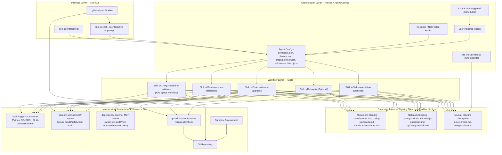
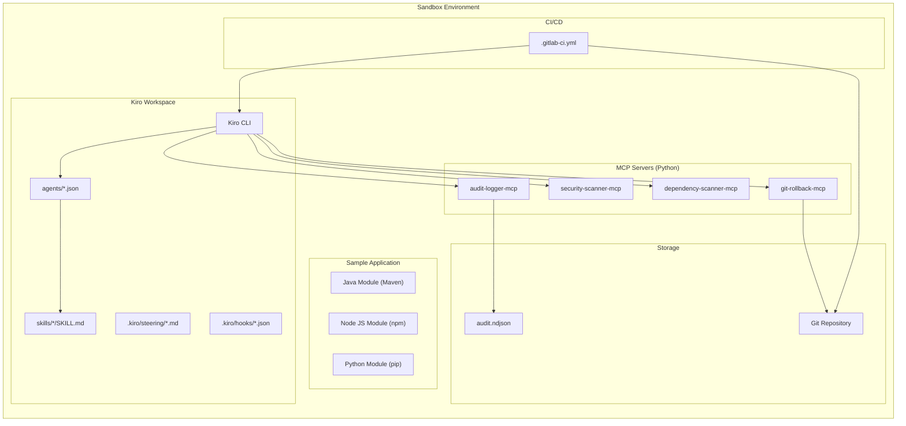
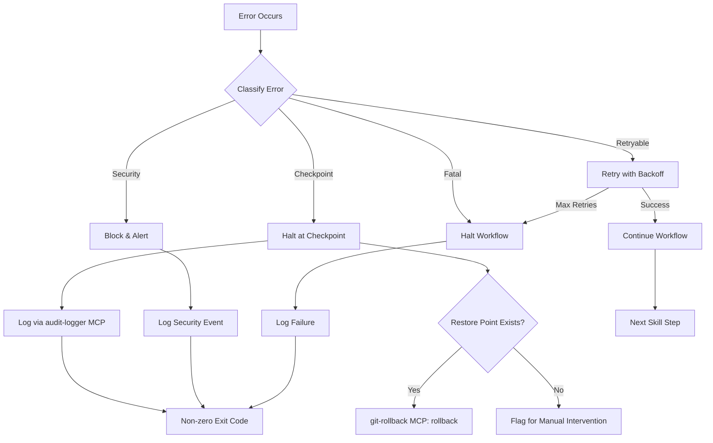

# Design Document: Autonomous AI SDLC Prototype (Kiro-Native)

## Overview

This design describes the architecture and components for an autonomous AI-driven Software Development Lifecycle (SDLC) prototype, rebuilt entirely on Kiro-native patterns. Instead of building a custom Python workflow engine, CLI, guardrails framework, and trigger engine from scratch, this design leverages Kiro's built-in primitives: Skills, Hooks, Steering files, Agent configs, and MCP servers.

The system operates within an isolated sandbox environment and orchestrates five end-to-end AI workflows (3 mandatory, 2 optional). Guardrails are enforced via steering files (always-on rules) and `preToolUse` hooks (checkpoint enforcement). An audit logger MCP server provides full traceability with NDJSON append-only logging and SHA-256 hash chains. Hooks replace the custom trigger engine. The Kiro CLI (`kiro-cli chat --no-interactive`) replaces the custom Python CLI for both interactive and headless CI/CD execution.

The prototype is delivered over 4 weeks by 5 developers. Custom code is limited to 4 lightweight MCP servers (audit-logger, security-scanner, dependency-scanner, git-rollback) and a multi-language sample application.

### Key Design Decisions

1. **Kiro CLI as single entry point**: All AI interactions flow through `kiro-cli` (interactive) or `kiro-cli chat --no-interactive -a "prompt"` (headless CI/CD). No custom CLI code needed.
2. **Skills replace workflow plugins**: Each E2E workflow becomes a Kiro skill with `SKILL.md`, `references/`, and `scripts/`. Skills define workflow steps, checkpoints, and expected outputs. Agents load skills via the `resources` field.
3. **Steering files replace guardrails framework**: Always-included steering files enforce coding standards, security rules, and quality gates. `fileMatch`-based steering files enforce language-specific rules. Manual-inclusion steering files provide workflow-specific guardrails.
4. **Hooks replace trigger engine**: `fileEdited`, `fileCreated`, `userTriggered` hooks trigger workflows. Scheduled triggers use cron + `userTriggered` hooks. `preToolUse` hooks enforce checkpoint validation before tool execution.
5. **MCP servers replace custom infrastructure**: Lightweight Python MCP servers for audit logging, security scanning, dependency scanning, and Git rollback. Configured in agent JSON files.
6. **Git-native rollback via MCP server**: The git-rollback MCP server wraps `gitpython` for restore points and rollback, exposing tools like `create_restore_point`, `rollback`, and `verify_consistency`.
7. **Specs ARE WF1**: Kiro's spec-driven development workflow (requirements → design → tasks → implementation) is exactly WF1 (Requirement to Working Software). No custom workflow code needed for WF1.

## Architecture

The system follows a layered architecture mapping directly to Kiro primitives.



### Deployment View




## Components and Interfaces

### 1. Kiro CLI Interface (No Custom Code)

The system uses the Kiro CLI directly. No custom CLI wrapper is needed.

**Interactive Mode**: Developer opens Kiro, selects an agent, and interacts naturally. Skills guide the workflow.

**Headless Mode (CI/CD)**: Pipelines invoke workflows via:
```bash
kiro-cli chat --no-interactive -a "Execute WF3 dependency upgrade for sample-app/java-module"
```

Exit codes: 0 (success), non-zero (failure). Structured output is captured from stdout.

**Agent Selection**: The `-a` flag or agent configs route to the correct agent. Each agent's `resources` field loads the appropriate skills.

**Audit Integration**: The audit-logger MCP server is configured in each agent's `mcpServers` section, so all AI interactions are automatically logged.

### 2. Skills (Workflow Layer)

Each E2E workflow is a Kiro skill. Skills are stored in `skills/` and loaded by agents via the `resources` field.

#### Skill Structure

```
skills/
├── developer-skills/
│   ├── wf1-requirement-to-software/
│   │   ├── SKILL.md              # Workflow steps, checkpoints, expected outputs
│   │   ├── references/
│   │   │   ├── checkpoint-criteria.md
│   │   │   └── output-format.md
│   │   └── scripts/
│   │       └── validate_output.py
│   ├── wf2-autonomous-refactoring/
│   │   ├── SKILL.md
│   │   ├── references/
│   │   │   ├── refactoring-patterns.md
│   │   │   └── behavior-equivalence.md
│   │   └── scripts/
│   │       ├── run_benchmarks.py
│   │       └── compare_behavior.py
│   ├── wf3-dependency-upgrades/
│   │   ├── SKILL.md
│   │   ├── references/
│   │   │   ├── upgrade-strategy.md
│   │   │   └── compatibility-checks.md
│   │   └── scripts/
│   │       └── generate_delta_report.py
│   ├── wf4-bug-fix/
│   │   ├── SKILL.md
│   │   ├── references/
│   │   │   └── root-cause-analysis.md
│   │   └── scripts/
│   │       └── validate_fix.py
│   └── wf5-documentation/
│       ├── SKILL.md
│       ├── references/
│       │   ├── doc-standards.md
│       │   └── completeness-criteria.md
│       └── scripts/
│           └── validate_docs.py
└── shared-skills/
    └── delta-report-generator/
        ├── SKILL.md
        └── scripts/
            └── generate_delta_report.py
```

#### SKILL.md Interface (Example: WF2 Autonomous Refactoring)

```markdown
---
name: wf2-autonomous-refactoring
description: Refactors legacy code while preserving behavior. Use when refactoring
  technical debt, modernizing code patterns, or improving code quality. Covers
  behavior equivalence testing, performance benchmarking, and delta report generation.
metadata:
  author: sdlc-prototype-team
  version: "1.0.0"
---

# Autonomous Refactoring Workflow

## Workflow Steps

1. **Analyze Legacy Code** — Identify technical debt, code smells, and refactoring opportunities
2. **Create Restore Point** — Use git-rollback MCP: `create_restore_point`
3. **Apply Refactoring** — Generate refactored code applying modern patterns
4. **Run Existing Tests** — Execute all pre-existing unit tests against refactored code
5. **Behavior Equivalence Check** — Compare original vs refactored behavior
6. **Performance Benchmark** — Run benchmarks comparing original vs refactored
7. **Security Scan** — Use security-scanner MCP: `scan_code`
8. **Generate Delta Report** — Use delta-report-generator skill
9. **Log to Audit** — Use audit-logger MCP: `log_workflow_event`

## Checkpoints (MUST pass before proceeding)

- [ ] All existing unit tests pass on refactored code
- [ ] No new security vulnerabilities introduced
- [ ] Performance not degraded beyond acceptable threshold
- [ ] Behavior equivalence verified

## If Any Checkpoint Fails

STOP. Do NOT proceed. Report failure details. Use git-rollback MCP: `rollback` to restore.
Log failure via audit-logger MCP: `log_checkpoint`.
```

### 3. Steering Files (Guardrails Layer)

Steering files replace the custom Guardrails Framework. They are Markdown files in `.kiro/steering/` with front-matter controlling inclusion.

#### Steering File Structure

```
.kiro/steering/
├── security-rules.md          # inclusion: always
├── coding-standards.md        # inclusion: always
├── sandbox-boundaries.md      # inclusion: always
├── java-guardrails.md         # inclusion: fileMatch, globs: ["**/*.java"]
├── nodejs-guardrails.md       # inclusion: fileMatch, globs: ["**/*.js", "**/*.ts"]
├── python-guardrails.md       # inclusion: fileMatch, globs: ["**/*.py"]
├── checkpoint-enforcement.md  # inclusion: manual
└── merge-policy.md            # inclusion: manual
```

#### Steering File Interface (Example: security-rules.md)

```markdown
---
inclusion: always
---

# Security Rules

## Mandatory Security Checks

1. **No hardcoded secrets**: Never include API keys, passwords, tokens, or credentials in code.
2. **No production access**: Never access production systems, databases, or APIs from sandbox code.
3. **Input validation**: All user inputs must be validated and sanitized.
4. **Dependency security**: All dependencies must be scanned for known CVEs before use.
5. **SQL injection prevention**: Use parameterized queries. Never concatenate user input into SQL.

## Before Any Merge

- Run security-scanner MCP `scan_code` tool on all modified files
- If any HIGH or CRITICAL vulnerabilities found, BLOCK the merge
- Log scan results via audit-logger MCP `log_checkpoint` tool
```

#### Steering File Interface (Example: sandbox-boundaries.md)

```markdown
---
inclusion: always
---

# Sandbox Boundaries

## Absolute Restrictions

- NEVER access any URL outside the sandbox environment
- NEVER use production credentials or API keys
- NEVER connect to production databases
- NEVER deploy to production environments
- NEVER access sensitive data or PII

## Allowed Resources

- Git repositories within the sandbox
- Local file system within the workspace
- MCP servers configured in agent configs
- Sample application modules only
```

### 4. Hooks (Orchestration Layer)

Hooks replace the custom Trigger Engine. They are JSON files in `.kiro/hooks/` that define triggers and actions.

#### Hook Configuration Structure

```
.kiro/hooks/
├── on-code-change.json        # fileEdited → run security scan
├── on-new-file.json           # fileCreated → run lint + audit log
├── checkpoint-guard.json      # preToolUse → enforce checkpoints before git merge
├── audit-all-tools.json       # postToolUse → log all tool invocations to audit
├── manual-wf2-refactor.json   # userTriggered → run WF2
├── manual-wf3-upgrade.json    # userTriggered → run WF3
├── manual-wf4-bugfix.json     # userTriggered → run WF4
└── manual-wf5-docs.json       # userTriggered → run WF5
```

#### Hook Interface (Example: checkpoint-guard.json)

```json
{
  "name": "Checkpoint Guard — Block Merge Without Passing Checks",
  "trigger": {
    "type": "preToolUse",
    "toolName": "git_commit"
  },
  "actions": [
    {
      "type": "askAgent",
      "prompt": "Before committing, verify: 1) security-scanner MCP scan_code returned no HIGH/CRITICAL issues, 2) all unit tests pass, 3) test coverage meets minimum threshold. If any check has not been run or has failed, REJECT this commit and explain why."
    }
  ]
}
```

#### Hook Interface (Example: audit-all-tools.json)

```json
{
  "name": "Audit All Tool Invocations",
  "trigger": {
    "type": "postToolUse",
    "toolName": "*"
  },
  "actions": [
    {
      "type": "askAgent",
      "prompt": "Log this tool invocation to the audit-logger MCP server using the log_event tool. Include: tool name, parameters, result summary, timestamp."
    }
  ]
}
```

#### Hook Interface (Example: manual-wf3-upgrade.json)

```json
{
  "name": "Manual Trigger — Dependency Upgrade Workflow",
  "trigger": {
    "type": "userTriggered"
  },
  "actions": [
    {
      "type": "askAgent",
      "agent": "developer",
      "prompt": "Execute the WF3 Dependency Upgrade workflow. Follow the wf3-dependency-upgrades skill steps exactly. Target: sample-app/. Create a restore point first, scan for outdated dependencies, perform upgrades, run tests, generate delta report."
    }
  ]
}
```

#### Scheduled Triggers (Cron + Hook)

For scheduled workflows (e.g., nightly dependency checks), a cron job invokes the Kiro CLI in headless mode:

```bash
# crontab entry — nightly dependency scan at 2am
0 2 * * * kiro-cli chat --no-interactive -a "Execute WF3 dependency upgrade for sample-app/ with scope=security" >> /var/log/kiro-wf3.log 2>&1
```

Retry logic is handled by the CI/CD pipeline or a simple shell wrapper with exponential backoff:

```bash
#!/bin/bash
# retry-wrapper.sh — retry up to 3 times with exponential backoff
MAX_RETRIES=3
RETRY_DELAY=10
for i in $(seq 1 $MAX_RETRIES); do
  kiro-cli chat --no-interactive -a "$1" && exit 0
  echo "Attempt $i failed. Retrying in ${RETRY_DELAY}s..."
  sleep $RETRY_DELAY
  RETRY_DELAY=$((RETRY_DELAY * 2))
done
echo "All $MAX_RETRIES attempts failed."
exit 1
```

### 5. MCP Servers (Infrastructure Layer)

Four lightweight Python MCP servers provide infrastructure capabilities. Each exposes tools that agents can call.

#### 5.1 Audit Logger MCP Server

Append-only NDJSON logging with SHA-256 hash chain for tamper evidence.

**Tools exposed:**

| Tool | Parameters | Description |
|------|-----------|-------------|
| `log_interaction` | `workflow_id`, `initiator`, `input_prompt`, `ai_output`, `agent_role` | Log an AI interaction |
| `log_checkpoint` | `workflow_id`, `checkpoint_id`, `passed`, `validation_details`, `metrics` | Log a checkpoint result |
| `log_event` | `workflow_id`, `event_type`, `initiator`, `details` | Log a workflow lifecycle event |
| `query_audit` | `workflow_type?`, `date_from?`, `date_to?`, `initiator?`, `outcome?` | Query audit records with filters |

**Storage format (NDJSON):**

```json
{"id": "uuid-v4", "timestamp": "2026-03-20T14:30:00Z", "type": "interaction", "workflow_id": "wf1-req-to-software", "workflow_run_id": "run-abc123", "initiator": "developer-1", "content_hash": "sha256-of-payload", "previous_hash": "sha256-of-prior-record", "payload": {"input_prompt": "...", "ai_output": "...", "agent_role": "developer", "duration_ms": 1500}}
```

**Implementation:** Python MCP server using `mcp` SDK, `hashlib` for SHA-256, file I/O for NDJSON append.

#### 5.2 Security Scanner MCP Server

Wraps existing security scanning tools for each language.

**Tools exposed:**

| Tool | Parameters | Description |
|------|-----------|-------------|
| `scan_code` | `path`, `language` | Run security scan (bandit for Python, npm audit for Node, SpotBugs for Java) |
| `scan_dependencies` | `path`, `language` | Scan dependencies for known CVEs (safety for Python, npm audit for Node, OWASP for Java) |
| `get_scan_report` | `scan_id` | Retrieve detailed scan results |

**Implementation:** Python MCP server that shells out to `bandit`, `safety`, `npm audit`, `mvn org.owasp:dependency-check-maven:check`.

#### 5.3 Dependency Scanner MCP Server

Identifies outdated dependencies and available updates.

**Tools exposed:**

| Tool | Parameters | Description |
|------|-----------|-------------|
| `scan_outdated` | `project_path`, `language`, `scope` | Identify outdated dependencies |
| `check_compatibility` | `dependency`, `from_version`, `to_version` | Check breaking changes between versions |
| `get_upgrade_plan` | `project_path`, `language` | Generate ordered upgrade plan |

**Implementation:** Python MCP server wrapping `pip-audit`, `npm outdated`, `mvn versions:display-dependency-updates`.

#### 5.4 Git Rollback MCP Server

Git-native rollback with restore points and consistency verification.

**Tools exposed:**

| Tool | Parameters | Description |
|------|-----------|-------------|
| `create_restore_point` | `workflow_id`, `description` | Tag current commit as restore point, snapshot lockfiles |
| `rollback` | `restore_point_id`, `reason`, `initiator` | Revert to restore point, log to audit |
| `verify_consistency` | `test_command?` | Run test suite after rollback, report results |
| `list_restore_points` | — | List available restore points |

**Implementation:** Python MCP server using `gitpython` for Git operations, calling audit-logger MCP for logging.

#### MCP Server Configuration in Agent Configs

Each agent's JSON config includes the MCP servers it needs:

```json
{
  "mcpServers": {
    "audit-logger": {
      "command": "python3",
      "args": ["mcp-servers/audit-logger/server.py"],
      "env": {
        "AUDIT_LOG_PATH": "audit/audit.ndjson"
      }
    },
    "security-scanner": {
      "command": "python3",
      "args": ["mcp-servers/security-scanner/server.py"]
    },
    "dependency-scanner": {
      "command": "python3",
      "args": ["mcp-servers/dependency-scanner/server.py"]
    },
    "git-rollback": {
      "command": "python3",
      "args": ["mcp-servers/git-rollback/server.py"],
      "env": {
        "GIT_REPO_PATH": "."
      }
    }
  }
}
```

### 6. Agent Configurations (Updated)

The existing agent configs are extended with MCP servers and workflow-specific skill references.

```json
// agents/developer.json — additions
{
  "resources": [
    "skill://skills/developer-skills/*/SKILL.md",
    "skill://skills/shared-skills/*/SKILL.md"
  ],
  "mcpServers": {
    "audit-logger": { "command": "python3", "args": ["mcp-servers/audit-logger/server.py"] },
    "security-scanner": { "command": "python3", "args": ["mcp-servers/security-scanner/server.py"] },
    "dependency-scanner": { "command": "python3", "args": ["mcp-servers/dependency-scanner/server.py"] },
    "git-rollback": { "command": "python3", "args": ["mcp-servers/git-rollback/server.py"] }
  }
}
```

### 7. Deployment Pipeline (.gitlab-ci.yml)

The CI/CD pipeline is a standard `.gitlab-ci.yml` that invokes Kiro CLI in headless mode.

```yaml
# .gitlab-ci.yml
stages:
  - lint
  - test
  - security
  - deploy

lint:
  stage: lint
  script:
    - ruff check mcp-servers/
    - mypy mcp-servers/

test:
  stage: test
  script:
    - pytest tests/ -v --tb=short
    - cd sample-app/java-module && mvn test
    - cd sample-app/nodejs-module && npm test
    - cd sample-app/python-module && pytest

security:
  stage: security
  script:
    - bandit -r mcp-servers/ -f json -o security-report.json
    - safety check --json > dependency-report.json

deploy:
  stage: deploy
  only:
    - main
  script:
    - echo "Deploy to sandbox environment"
  environment:
    name: sandbox
```

### Workflow-Specific Interfaces

#### WF1: Requirement to Working Software (Kiro Specs)

WF1 maps directly to Kiro's spec-driven development workflow. The skill guides the agent through:

1. Create a Kiro spec (requirements.md → design.md → tasks.md)
2. Implement tasks from the generated task list
3. At each checkpoint: invoke security-scanner MCP, run tests, check coverage
4. If all pass: commit and push
5. Log everything via audit-logger MCP

**Input:** Natural language requirement or user story
**Output:** Merged, tested, documented feature with audit trail

#### WF2: Autonomous Refactoring

**Input:** Target module path + refactoring goals
**Output:** Refactored code + delta report + performance benchmarks

The skill orchestrates: restore point → refactor → test → benchmark → security scan → delta report → audit log.

#### WF3: Dependency Upgrades

**Input:** Project path + scope (all/security/major/minor)
**Output:** Updated dependencies + delta report + restore point ID

The skill orchestrates: restore point → dependency-scanner MCP scan → upgrade → test → delta report → audit log.

#### WF4: Bug Fix (Optional)

**Input:** Bug report or failing test reference + target module
**Output:** Fix + regression tests + side-effect analysis

#### WF5: Documentation (Optional)

**Input:** Target codebase path + doc types (api/architecture/onboarding)
**Output:** Generated documentation + delta report comparing with existing docs


## Data Models

### Audit Record Schema (NDJSON)

Each line in `audit/audit.ndjson` is a self-contained JSON record:

```typescript
interface StoredAuditRecord {
  id: string;                   // UUID v4
  timestamp: string;            // ISO 8601 with timezone
  type: "interaction" | "checkpoint" | "event";
  workflow_id: string;          // e.g., "wf1-requirement-to-software"
  workflow_run_id: string;      // unique per execution
  initiator: string;            // user ID, agent name, or "cron-scheduler"
  content_hash: string;         // SHA-256(JSON.stringify(payload))
  previous_hash: string;        // hash of previous record (chain)
  payload: InteractionPayload | CheckpointPayload | EventPayload;
}

interface InteractionPayload {
  input_prompt: string;
  ai_output: string;
  agent_role: string;
  duration_ms: number;
}

interface CheckpointPayload {
  checkpoint_id: string;
  passed: boolean;
  validation_details: string;
  metrics: Record<string, number>;  // e.g., { coverage_percent: 85 }
}

interface EventPayload {
  event_type: string;           // "workflow_start", "workflow_end", "rollback", "trigger_fired"
  details: Record<string, string>;
}
```

### Steering File Front-Matter Schema

```yaml
---
inclusion: always | fileMatch | manual
globs:                          # only for fileMatch
  - "**/*.java"
  - "**/*.py"
---
```

### Hook Configuration Schema

```typescript
interface HookConfig {
  name: string;
  trigger: {
    type: "fileEdited" | "fileCreated" | "fileDeleted" | "userTriggered" | "promptSubmit" | "preToolUse" | "postToolUse";
    toolName?: string;          // for preToolUse/postToolUse
    globs?: string[];           // for file-based triggers
  };
  actions: HookAction[];
}

interface HookAction {
  type: "askAgent" | "runCommand";
  agent?: string;               // agent name for askAgent
  prompt?: string;              // for askAgent
  command?: string;             // for runCommand
}
```

### MCP Server Tool Schema (Audit Logger)

```typescript
// Tool: log_interaction
interface LogInteractionParams {
  workflow_id: string;
  initiator: string;
  input_prompt: string;
  ai_output: string;
  agent_role: string;
}

// Tool: log_checkpoint
interface LogCheckpointParams {
  workflow_id: string;
  checkpoint_id: string;
  passed: boolean;
  validation_details: string;
  metrics?: Record<string, number>;
}

// Tool: log_event
interface LogEventParams {
  workflow_id: string;
  event_type: string;
  initiator: string;
  details?: Record<string, string>;
}

// Tool: query_audit
interface QueryAuditParams {
  workflow_type?: string;
  date_from?: string;           // ISO 8601
  date_to?: string;             // ISO 8601
  initiator?: string;
  outcome?: "success" | "failed";
  type?: "interaction" | "checkpoint" | "event";
}

// Returns: AuditRecord[]
```

### MCP Server Tool Schema (Git Rollback)

```typescript
// Tool: create_restore_point
interface CreateRestorePointParams {
  workflow_id: string;
  description: string;
}
// Returns: { restore_point_id: string, git_commit_hash: string, timestamp: string }

// Tool: rollback
interface RollbackParams {
  restore_point_id: string;
  reason: string;
  initiator: string;
}
// Returns: { success: boolean, details: string }

// Tool: verify_consistency
interface VerifyConsistencyParams {
  test_command?: string;        // defaults to "pytest" or auto-detect
}
// Returns: { consistent: boolean, tests_run: number, tests_passed: number, tests_failed: number }

// Tool: list_restore_points
// No params
// Returns: RestorePoint[]
```

### Delta Report Schema

```typescript
interface DeltaReport {
  report_id: string;
  workflow_id: string;
  workflow_run_id: string;
  timestamp: string;
  summary: string;
  changes: DeltaChange[];
  metrics: {
    files_modified: number;
    lines_added: number;
    lines_removed: number;
    tests_added: number;
    tests_passed: number;
    tests_failed: number;
    coverage_before: number;
    coverage_after: number;
  };
  before_snapshot: string;      // git commit hash
  after_snapshot: string;       // git commit hash
}

interface DeltaChange {
  file_path: string;
  change_type: "added" | "modified" | "deleted";
  description: string;
}
```

### Sample Application Structure

```
sample-app/
├── java-module/
│   ├── src/main/java/com/example/...
│   ├── src/test/java/com/example/...
│   ├── pom.xml                 # with outdated dependencies for WF3
│   └── legacy/                 # technical debt for WF2
├── nodejs-module/
│   ├── src/
│   ├── test/
│   ├── package.json            # with outdated dependencies for WF3
│   └── legacy/                 # technical debt for WF2
├── python-module/
│   ├── src/
│   ├── tests/
│   ├── requirements.txt        # with outdated dependencies for WF3
│   └── legacy/                 # technical debt for WF2
└── docs/                       # existing docs for WF5 comparison
```


## Correctness Properties

*A property is a characteristic or behavior that should hold true across all valid executions of a system — essentially, a formal statement about what the system should do. Properties serve as the bridge between human-readable specifications and machine-verifiable correctness guarantees.*

### Property 1: Sandbox Access Control Enforcement

*For any* request to access a resource, if the resource is a production system, production credential, or production API, the sandbox boundary enforcement (steering files + MCP server validation) shall deny the request. Additionally, *for any* access request from a user, the system shall verify authentication and authorization before granting access.

**Validates: Requirements 1.2, 1.5, 4.7**

### Property 2: Workflow Routing Correctness

*For any* valid workflow ID and agent role submitted to the Kiro CLI (interactive or headless), the system shall route the request to the skill whose name matches the requested workflow, and the agent executing the workflow shall match the requested agent role as defined in the agent JSON config.

**Validates: Requirements 2.2, 2.3**

### Property 3: Headless Mode Structured Output

*For any* workflow execution in headless mode (`kiro-cli chat --no-interactive`) with any valid set of workflow parameters (provided via CLI arguments), the output shall be parseable structured text, and the exit code shall be 0 for success or non-zero for failure — matching the workflow outcome.

**Validates: Requirements 2.6, 2.7, 2.8**

### Property 4: Audit Record Completeness and Tamper Evidence

*For any* audit record stored in `audit.ndjson`, the record shall contain a non-empty `initiator`, a valid ISO 8601 `timestamp`, and a `content_hash` that equals SHA-256 of the record payload. For interaction records, `input_prompt` and `ai_output` shall be non-empty. For checkpoint records, `passed` status and `validation_details` shall be present. The `previous_hash` field shall equal the `content_hash` of the immediately preceding record, forming a verifiable hash chain.

**Validates: Requirements 5.1, 5.2, 5.3, 5.4**

### Property 5: Universal Audit Logging

*For any* system action — including AI interactions, checkpoint evaluations, trigger events (hook firings), pipeline activities, workflow executions, and rollback operations — the audit-logger MCP server shall contain a corresponding audit record with a timestamp within the action's execution window.

**Validates: Requirements 2.4, 4.5, 6.5, 7.5, 8.9, 9.7, 10.8, 11.6, 12.7, 15.3**

### Property 6: Audit Query Filter Correctness

*For any* set of audit records and any filter (by workflow type, date range, initiator, or outcome), the `query_audit` MCP tool shall return exactly those records that match all specified filter criteria — no more, no fewer.

**Validates: Requirements 5.6**

### Property 7: Guardrail Configuration Round-Trip

*For any* steering file configuration defining guardrail rules, loading the steering files into the Kiro workspace and inspecting the active rules shall yield the same set of rules as defined in the files. Modifying a steering file (adding, changing, or removing rules) shall reflect the changes immediately without code redeployment — only a file save is needed.

**Validates: Requirements 4.1, 4.6**

### Property 8: Checkpoint Enforcement Before Merge

*For any* workflow execution that produces code artifacts and attempts a merge (via git commit/push), the `preToolUse` hook and skill checkpoint steps shall have executed and recorded pass results for all required checkpoints (code review, security scan, test coverage) before the merge is permitted. If any required checkpoint has not been executed or has not passed, the merge shall not occur.

**Validates: Requirements 4.2, 4.3, 4.4, 8.4, 8.5, 8.6**

### Property 9: Checkpoint Failure Halts Workflow

*For any* checkpoint execution (via security-scanner MCP, test runner, or code review) that returns a failure result, the workflow skill shall transition to a halted state, the merge (or equivalent final action) shall not occur, and the failure details shall be recorded via the audit-logger MCP `log_checkpoint` tool.

**Validates: Requirements 4.5, 8.8, 9.6, 10.7, 11.5**

### Property 10: Trigger Routing and Parameter Passing

*For any* trigger (manual via `userTriggered` hook, scheduled via cron + headless CLI, or event-based via `fileEdited`/`fileCreated` hook), the system shall initiate the correct workflow skill with the configured parameters. The workflow context shall contain all parameters specified in the hook configuration or CLI arguments.

**Validates: Requirements 6.1, 6.2, 6.3, 6.4**

### Property 11: Trigger Retry with Exponential Backoff

*For any* workflow initiation failure from a scheduled or event-based trigger, the retry wrapper shall retry up to 3 times with exponential backoff. After each retry attempt, a failure log entry shall be recorded via the audit-logger MCP. After 3 failed retries, the trigger shall be marked as failed.

**Validates: Requirements 6.6**

### Property 12: Pipeline Stage Enforcement

*For any* merge to the main branch, the `.gitlab-ci.yml` pipeline shall execute lint, test, security scan stages in order. If any stage fails, subsequent stages (including deploy) shall not execute, and the team shall be notified.

**Validates: Requirements 7.1, 7.2, 7.3**

### Property 13: Refactoring Behavior Preservation

*For any* refactoring workflow (WF2) execution, all pre-existing unit tests shall pass against the refactored code. If any pre-existing test fails, the refactoring shall be rejected, the git-rollback MCP shall restore the previous state, and the behavioral differences shall be reported.

**Validates: Requirements 9.2, 9.3**

### Property 14: Dependency Upgrade Detection

*For any* project with outdated dependencies, the dependency-scanner MCP `scan_outdated` tool shall identify all dependencies where the installed version is older than the latest available version. For each identified outdated dependency, the `check_compatibility` tool shall perform compatibility checking and, if breaking changes are detected, the workflow shall generate code updates.

**Validates: Requirements 10.1, 10.2, 10.3**

### Property 15: Workflow Output Artifact Completeness

*For any* workflow execution, the output shall contain all required artifact types for that workflow:
- WF1 (Requirement to Software): code artifacts, test artifacts, documentation artifacts
- WF2 (Refactoring): refactored code, performance benchmarks, delta report
- WF4 (Bug Fix, when enabled): code fix, regression tests, side-effect analysis
- WF5 (Documentation, when enabled): API docs, architecture diagrams, onboarding guides, delta report

**Validates: Requirements 8.2, 8.3, 9.4, 9.5, 11.2, 11.3, 11.4, 12.1, 12.2, 12.3, 12.4**

### Property 16: Rollback Round-Trip

*For any* AI-generated change (code change or dependency upgrade), creating a restore point via git-rollback MCP `create_restore_point` before the change, applying the change, and then rolling back via `rollback` shall restore the Git repository to the exact state captured by the restore point. After rollback, the `verify_consistency` tool shall execute the automated test suite and all tests shall pass.

**Validates: Requirements 10.5, 15.1, 15.2, 15.4**

### Property 17: Documentation Checkpoint Enforcement

*For any* documentation workflow (WF5) execution (when enabled), the generated documentation shall be submitted to both an accuracy validation checkpoint and a completeness review checkpoint before being finalized. Both checkpoints must pass before the documentation is accepted.

**Validates: Requirements 12.5, 12.6**


## Error Handling

### Error Categories

| Category | Examples | Handling Strategy |
|----------|----------|-------------------|
| **Input Validation** | Invalid workflow ID, malformed hook config, empty requirement text | Skill rejects input immediately with details. Non-zero exit code in headless mode. |
| **AI Generation Failure** | AI model timeout, rate limit, incoherent output | Skill retries up to 2 times. Logs to audit-logger MCP. Halts workflow on persistent failure. |
| **Checkpoint Failure** | Security scan finds CVE, coverage below threshold, code review rejection | Skill halts workflow, logs via audit-logger MCP `log_checkpoint`, does not merge. Uses git-rollback MCP to restore if changes were applied. |
| **MCP Server Failure** | Audit-logger unreachable, security-scanner crash, git-rollback conflict | Retry with backoff. Alert team. Halt workflow if unrecoverable. |
| **Hook Failure** | preToolUse hook fails, postToolUse hook crashes | Hook action fails gracefully. Kiro logs the error. Workflow continues only if the hook is non-blocking. |
| **Trigger Failure** | Cron job fails, headless CLI returns non-zero, event handler crash | Retry wrapper retries up to 3 times with exponential backoff per Req 6.6. Log each attempt via audit-logger MCP. |
| **Rollback Failure** | Git revert conflict, test suite fails after rollback | Log failure via audit-logger MCP, alert team, flag state as requiring manual intervention. |
| **Sandbox Boundary Violation** | Attempt to access production resource, external network call | Steering file rules block immediately. Audit-logger MCP logs security event. Workflow halts. |

### Error Propagation



### Rollback on Error

When a workflow fails mid-execution after making changes:
1. The skill checks if a restore point was created via git-rollback MCP `list_restore_points`.
2. If a restore point exists, the skill calls `rollback` to revert.
3. If rollback succeeds, `verify_consistency` runs the test suite.
4. If rollback fails or no restore point exists, the system flags the state as requiring manual intervention and logs the details via audit-logger MCP.

## Testing Strategy

### Dual Testing Approach

This project uses both unit tests and property-based tests for comprehensive coverage:

- **Unit tests**: Verify specific examples, edge cases, integration points, and error conditions with concrete inputs and expected outputs.
- **Property-based tests**: Verify universal properties (the 17 correctness properties above) across many randomly generated inputs, ensuring the system behaves correctly for all valid inputs, not just hand-picked examples.

Both are complementary and necessary. Unit tests catch concrete bugs and document expected behavior. Property tests verify general correctness and find edge cases humans wouldn't think of.

### Property-Based Testing Configuration

**Library Selection by Language:**
- **Python** (MCP servers, scripts): Hypothesis (industry standard Python PBT library)
- **Java** (sample app module): jqwik (JUnit 5 compatible, mature PBT library)
- **Node JS** (sample app module): fast-check (most popular JS PBT library)

**Configuration:**
- Minimum 100 iterations per property test
- Each property test must reference its design document property via tag comment
- Tag format: `Feature: autonomous-ai-sdlc-prototype, Property {number}: {property_text}`

**Example tag in test code:**
```python
# Feature: autonomous-ai-sdlc-prototype, Property 4: Audit Record Completeness and Tamper Evidence
@given(st.builds(AuditRecord, ...))
@settings(max_examples=100)
def test_audit_record_completeness_and_tamper_evidence(record):
    # ... property assertion
```

### Test Categories and Mapping

| Test Type | Scope | Properties Covered | Tools |
|-----------|-------|-------------------|-------|
| **PBT: Sandbox Access** | Unit | P1 | Hypothesis |
| **PBT: Workflow Routing** | Unit | P2 | Hypothesis |
| **PBT: Headless Output** | Integration | P3 | Hypothesis |
| **PBT: Audit Integrity** | Unit | P4 | Hypothesis |
| **PBT: Universal Audit** | Integration | P5 | Hypothesis |
| **PBT: Audit Filtering** | Unit | P6 | Hypothesis |
| **PBT: Guardrail Config** | Unit | P7 | Hypothesis |
| **PBT: Checkpoint Enforcement** | Integration | P8, P9 | Hypothesis |
| **PBT: Trigger Routing** | Unit | P10 | Hypothesis |
| **PBT: Trigger Retry** | Unit | P11 | Hypothesis |
| **PBT: Pipeline Stages** | Integration | P12 | Hypothesis |
| **PBT: Behavior Preservation** | Integration | P13 | Hypothesis / jqwik |
| **PBT: Dependency Detection** | Unit | P14 | Hypothesis |
| **PBT: Artifact Completeness** | Unit | P15 | Hypothesis |
| **PBT: Rollback Round-Trip** | Integration | P16 | Hypothesis |
| **PBT: Doc Checkpoints** | Integration | P17 | Hypothesis |
| **Unit: Sample App Structure** | Example | Req 3.1-3.5 | pytest / JUnit / Jest |
| **Unit: Steering File Loading** | Example | Req 4.1 | pytest |
| **Unit: Hook Config Parsing** | Example | Req 6.1-6.3 | pytest |
| **Unit: MCP Server Tool Schemas** | Example | All MCP tools | pytest |
| **Unit: NDJSON Append** | Edge case | Req 5.4 | pytest |
| **Unit: Empty Input Rejection** | Edge case | Req 8.1 | pytest |

### Each Correctness Property = One Property-Based Test

Each of the 17 correctness properties above must be implemented as exactly one property-based test. The test generates random valid inputs, exercises the system under test, and asserts the property holds. This ensures:
- Full traceability from requirement → property → test
- No property is accidentally split across multiple tests
- Clear pass/fail per property

### Unit Test Focus Areas

Unit tests should focus on:
- Concrete examples demonstrating correct behavior (e.g., "given this specific steering file, these rules are active")
- Integration points between components (e.g., hook fires → agent invoked → skill loaded → MCP tool called)
- Edge cases: empty inputs, malformed configs, boundary values for thresholds
- Error conditions: MCP server unavailable, invalid JSON in audit log, git conflicts during rollback

Avoid writing excessive unit tests for scenarios already covered by property tests. Property tests handle input diversity; unit tests handle specific known scenarios and integration verification.
