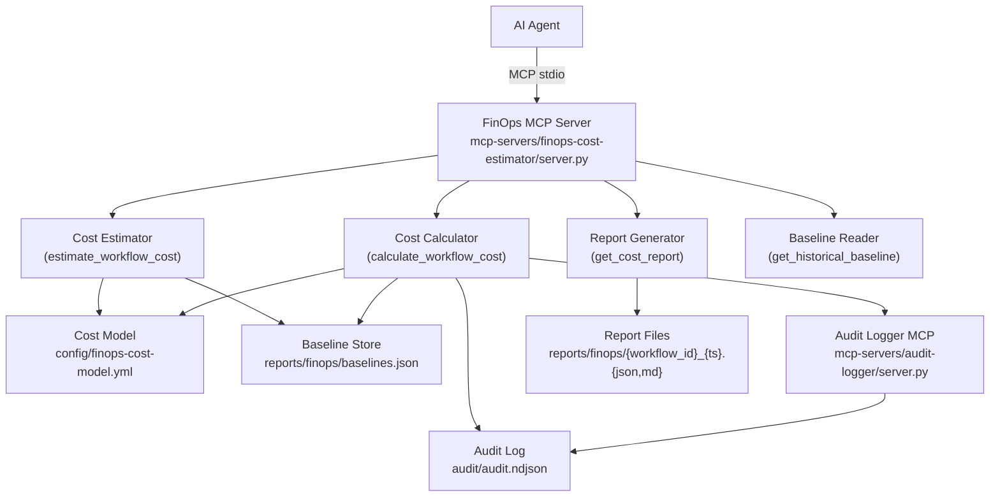

# Design Document: FinOps Workflow Cost Estimation

## Overview

The FinOps Workflow Cost Estimation feature adds a read/compute/report layer on top of the existing AI-DLC audit infrastructure. It does not modify any workflow behavior — it reads from `audit/audit.ndjson`, computes cost metrics, and writes reports to `reports/finops/`.

The feature is delivered as a new MCP server (`mcp-servers/finops-cost-estimator/server.py`) following the same FastMCP + stdio pattern used by all existing MCP servers in the project. It exposes four tools: `estimate_workflow_cost`, `calculate_workflow_cost`, `get_cost_report`, and `get_historical_baseline`.

Cost is modeled across five dimensions: `llm_tokens_input`, `llm_tokens_output`, `compute_time_seconds`, `mcp_tool_invocations`, and `checkpoint_executions`. Unit prices are configured in `config/finops-cost-model.yml`. Historical baselines are persisted to `reports/finops/baselines.json` and improve estimate accuracy over time.

## Architecture



### Key Design Decisions

1. **Read-only audit access**: The FinOps server reads `audit/audit.ndjson` directly (file I/O) rather than going through the audit-logger MCP's `query_audit` tool. This avoids a circular dependency and is consistent with how the audit log is a flat append-only file. The audit-logger MCP is only used for *writing* new FinOps events.

2. **Baseline as a separate JSON file**: `reports/finops/baselines.json` is a simple JSON file rather than a database. This keeps the implementation self-contained and consistent with the project's file-based approach.

3. **Synchronous stdio transport**: Consistent with all other MCP servers. No async framework needed given the workload (file I/O + arithmetic).

4. **No workflow modification**: The server is purely additive. It never writes to `audit/audit.ndjson` directly — only via the audit-logger MCP's `log_event` tool.

## Components and Interfaces

### FinOps MCP Server (`mcp-servers/finops-cost-estimator/server.py`)

The top-level FastMCP server. Loads the cost model at startup and exposes four tools.

```python
mcp = FastMCP("finops-cost-estimator")
```

**Tool: `estimate_workflow_cost`**
```
Parameters:
  workflow_type: str  # "wf1" or "wf2"
  scope_input: dict   # {files_to_modify?, files_to_refactor?, estimated_checkpoints?, ...}
  workflow_id: str?   # optional, used to store estimate for later variance

Returns: PreRunEstimate
```

**Tool: `calculate_workflow_cost`**
```
Parameters:
  workflow_id: str

Returns: PostRunActuals + VarianceReport? (if estimate exists for workflow_id)
```

**Tool: `get_cost_report`**
```
Parameters:
  workflow_id: str
  format: str  # "json" or "markdown"

Returns: str (JSON or Markdown content)
```

**Tool: `get_historical_baseline`**
```
Parameters:
  workflow_type: str  # "wf1" or "wf2"

Returns: HistoricalBaseline
```

### Cost Model Loader (`_load_cost_model`)

Reads and validates `config/finops-cost-model.yml`. Called once at server startup and cached. Returns a typed dict or raises a descriptive `ValueError` on missing/invalid fields.

### Cost Estimator (`_estimate_cost`)

Pure function: `(workflow_type, scope_input, cost_model, baseline) -> PreRunEstimate`

1. Selects the appropriate baseline (WF1 or WF2) from `baselines.json`, or falls back to cost model defaults.
2. Scales dimension quantities using `scope_input` fields and per-file scaling factors.
3. Multiplies quantities by unit prices to produce per-dimension costs.
4. Sums to `total_estimated_cost_usd`.
5. Computes `confidence_level` from baseline run count.

### Cost Calculator (`_calculate_actuals`)

Pure function: `(workflow_id, audit_records, cost_model) -> PostRunActuals`

1. Filters records by `workflow_id`.
2. Extracts `workflow_start` and `workflow_end` event timestamps for `compute_time_seconds`.
3. Counts `type: "event"` + `payload.event_type: "tool_invocation"` records for `mcp_tool_invocations`.
4. Counts `type: "checkpoint"` records for `checkpoint_executions`.
5. Sums `payload.input_tokens` / `payload.output_tokens` from `type: "interaction"` records (falls back to char/4 ratio if absent).
6. Applies unit prices to produce `total_actual_cost_usd`.

### Variance Calculator (`_calculate_variance`)

Pure function: `(estimate: PreRunEstimate, actuals: PostRunActuals) -> VarianceReport`

Computes per-dimension absolute and percentage variance, flags overruns (>20%), and sums `total_variance_usd`.

### Baseline Manager (`_update_baseline`, `_load_baseline`, `_save_baseline`)

Manages `reports/finops/baselines.json`. After each `calculate_workflow_cost` call, appends the new actuals record and recomputes mean, p50, p95 for the relevant workflow type using `statistics.median` and `numpy.percentile` (or a pure-Python fallback).

### Report Generator (`_generate_report`)

Produces both JSON and Markdown representations of a `CostReport`. Writes files to `reports/finops/{workflow_id}_{timestamp}.json` and `.md`.

### Audit Logger Client (`_log_finops_event`)

Thin wrapper that calls the audit-logger MCP's `log_event` tool via subprocess (same pattern used by other MCP servers that need to call sibling servers). Logs `cost_estimate_produced`, `cost_actuals_computed`, and `cost_variance_reported` events.

## Data Models

### `ScopeInput`
```python
{
  "files_to_modify": int?,        # WF1 scaling
  "files_to_refactor": int?,      # WF2 scaling
  "estimated_checkpoints": int?,  # override checkpoint estimate
  "estimated_interactions": int?  # override interaction estimate
}
```

### `CostDimensions`
```python
{
  "llm_tokens_input": float,
  "llm_tokens_output": float,
  "compute_time_seconds": float,
  "mcp_tool_invocations": float,
  "checkpoint_executions": float
}
```

### `PreRunEstimate`
```python
{
  "workflow_id": str?,
  "workflow_type": str,                  # "wf1" | "wf2"
  "generated_at": str,                   # ISO 8601
  "baseline_source": str,                # "default" | "historical"
  "baseline_run_count": int,
  "confidence_level": str,               # "low" | "medium" | "high"
  "dimensions": {
    "<dim_name>": {
      "estimated_quantity": float,
      "unit_price_usd": float,
      "estimated_cost_usd": float
    }
  },
  "behavior_equivalence_overhead_usd": float?,  # WF2 only
  "total_estimated_cost_usd": float,
  "cost_model_version": str
}
```

### `PostRunActuals`
```python
{
  "workflow_id": str,
  "workflow_type": str,
  "generated_at": str,
  "token_count_method": str,             # "recorded" | "estimated"
  "dimensions": {
    "<dim_name>": {
      "actual_quantity": float,
      "unit_price_usd": float,
      "actual_cost_usd": float
    }
  },
  "total_actual_cost_usd": float,
  "cost_model_version": str
}
```

### `VarianceReport`
```python
{
  "workflow_id": str,
  "dimensions": {
    "<dim_name>": {
      "estimated_quantity": float,
      "actual_quantity": float,
      "estimated_cost_usd": float,
      "actual_cost_usd": float,
      "variance_usd": float,             # actual - estimate
      "variance_pct": float,             # (actual - estimate) / estimate * 100
      "overrun": bool
    }
  },
  "total_variance_usd": float
}
```

### `CostReport`
```python
{
  "workflow_id": str,
  "workflow_type": str,
  "generated_at": str,
  "estimate": PreRunEstimate?,
  "actuals": PostRunActuals?,
  "variance": VarianceReport?,
  "variance_available": bool,
  "cost_model_version": str
}
```

### `HistoricalBaseline`
```python
{
  "wf1": {
    "<dim_name>": {
      "count": int,
      "mean": float,
      "p50": float,
      "p95": float
    }
  },
  "wf2": { ... }
}
```

### `CostModel` (YAML schema at `config/finops-cost-model.yml`)
```yaml
version: "1.0.0"

unit_prices:
  llm_tokens_input_per_1k_usd: 0.003
  llm_tokens_output_per_1k_usd: 0.015
  compute_time_per_second_usd: 0.00005
  mcp_tool_invocation_usd: 0.0001
  checkpoint_execution_usd: 0.001

defaults:
  wf1:
    llm_tokens_input: 50000
    llm_tokens_output: 20000
    compute_time_seconds: 300
    mcp_tool_invocations: 40
    checkpoint_executions: 4
  wf2:
    llm_tokens_input: 80000
    llm_tokens_output: 30000
    compute_time_seconds: 600
    mcp_tool_invocations: 60
    checkpoint_executions: 3
    behavior_equivalence_overhead_usd: 0.05

scaling:
  wf1_per_file:
    llm_tokens_input: 5000
    llm_tokens_output: 2000
    compute_time_seconds: 30
  wf2_per_file:
    llm_tokens_input: 8000
    llm_tokens_output: 3000
    compute_time_seconds: 60
```

## Correctness Properties

*A property is a characteristic or behavior that should hold true across all valid executions of a system — essentially, a formal statement about what the system should do. Properties serve as the bridge between human-readable specifications and machine-verifiable correctness guarantees.*

### Property 1: Estimate contains all five cost dimensions

*For any* valid `workflow_type` ("wf1" or "wf2") and any `scope_input`, the `PreRunEstimate` returned by `_estimate_cost` must contain entries for all five dimensions: `llm_tokens_input`, `llm_tokens_output`, `compute_time_seconds`, `mcp_tool_invocations`, and `checkpoint_executions`.

**Validates: Requirements 1.1, 2.1, 2.4**

### Property 2: Dimension cost equals quantity times unit price

*For any* dimension quantity and unit price from the cost model, the computed dimension cost must equal `quantity * unit_price` (within floating-point tolerance). This holds for both estimates and actuals.

**Validates: Requirements 1.2, 3.6**

### Property 3: Total cost equals sum of dimension costs

*For any* `PreRunEstimate` or `PostRunActuals`, the `total_estimated_cost_usd` (or `total_actual_cost_usd`) must equal the sum of all individual dimension costs.

**Validates: Requirements 1.5, 4.4**

### Property 4: Confidence level matches run count thresholds

*For any* count of historical runs `n`, the `confidence_level` must be `"low"` when `n < 3`, `"medium"` when `3 <= n <= 9`, and `"high"` when `n >= 10`.

**Validates: Requirements 1.6, 2.5**

### Property 5: WF1 and WF2 baselines are independent

*For any* set of WF1 actuals added to the baseline, the WF2 baseline statistics must remain unchanged, and vice versa. Adding runs to one workflow type must not affect estimates for the other.

**Validates: Requirements 2.2**

### Property 6: File count scaling is proportional

*For any* `scope_input` with `files_to_modify` (WF1) or `files_to_refactor` (WF2) equal to `k`, the scaled dimension quantities for `llm_tokens_input`, `llm_tokens_output`, and `compute_time_seconds` must equal the base quantity plus `k * per_file_scaling_factor`.

**Validates: Requirements 2.3, 6.5, 6.6**

### Property 7: Audit record counts match computed dimension values

*For any* set of audit records for a `workflow_id`, the `mcp_tool_invocations` value must equal the count of records with `type == "event"` and `payload.event_type == "tool_invocation"`, and `checkpoint_executions` must equal the count of records with `type == "checkpoint"`. Similarly, `llm_tokens_input` must equal the sum of `payload.input_tokens` across all `type == "interaction"` records (or the char/4 estimate when the field is absent).

**Validates: Requirements 3.1, 3.2, 3.3, 10.1**

### Property 8: Compute time derived from start and end timestamps

*For any* pair of audit records with `event_type == "workflow_start"` and `event_type == "workflow_end"` for the same `workflow_id`, the computed `compute_time_seconds` must equal the elapsed seconds between the two timestamps.

**Validates: Requirements 3.4**

### Property 9: Variance report algebraic correctness

*For any* `PreRunEstimate` and `PostRunActuals` for the same `workflow_id`, the `VarianceReport` must satisfy: `variance_usd == actual_cost_usd - estimated_cost_usd` and `variance_pct == (actual_cost_usd - estimated_cost_usd) / estimated_cost_usd * 100` for every dimension, and `total_variance_usd == total_actual_cost_usd - total_estimated_cost_usd`.

**Validates: Requirements 4.1, 4.2, 4.4**

### Property 10: Overrun flag when actual exceeds estimate by more than 20%

*For any* dimension in a `VarianceReport`, `overrun` must be `True` if and only if `actual_cost_usd > estimated_cost_usd * 1.2`.

**Validates: Requirements 4.3**

### Property 11: Cost_Report JSON schema completeness

*For any* generated `CostReport`, the JSON representation must contain all required top-level fields: `workflow_id`, `workflow_type`, `generated_at`, `estimate` (nullable), `actuals` (nullable), `variance` (nullable), `variance_available`, and `cost_model_version`.

**Validates: Requirements 5.2, 6.4**

### Property 12: Markdown rendering contains required columns

*For any* `CostReport` that includes both estimate and actuals, the rendered Markdown must contain all six column headers: `Dimension`, `Estimated Quantity`, `Actual Quantity`, `Estimated Cost (USD)`, `Actual Cost (USD)`, `Variance (USD)`, `Variance (%)`.

**Validates: Requirements 5.3**

### Property 13: Cost_Report serialization round-trip

*For any* valid `CostReport` object, serializing to JSON then deserializing then serializing again must produce an equivalent JSON string (same field values, order-independent).

**Validates: Requirements 5.7**

### Property 14: Cost_Model validation accepts valid and rejects invalid configs

*For any* cost model dict that contains all required fields with non-negative numeric unit prices, the validator must accept it. *For any* cost model dict missing a required field or containing a negative unit price, the validator must raise a descriptive error.

**Validates: Requirements 6.2, 6.3, 10.4**

### Property 15: Baseline statistics correctness

*For any* list of actuals records for a workflow type, the computed `p50` must equal the statistical median and `p95` must equal the 95th percentile of the dimension values across all records.

**Validates: Requirements 7.2, 7.3**

### Property 16: Baseline persistence round-trip

*For any* `HistoricalBaseline` object, saving it to `baselines.json` then loading it back must produce an equivalent object with identical statistics for all dimensions and workflow types.

**Validates: Requirements 7.4**

### Property 17: Baseline order-independence

*For any* sequence of `PostRunActuals` records, adding them to the baseline in any permutation of order must produce identical `p50` and `p95` values for all dimensions.

**Validates: Requirements 7.6**

### Property 18: Every FinOps operation produces a corresponding audit event

*For any* call to `estimate_workflow_cost`, `calculate_workflow_cost`, or variance report generation, the audit log must contain a new record with the corresponding `event_type` (`cost_estimate_produced`, `cost_actuals_computed`, or `cost_variance_reported`) and the correct `workflow_id` and cost fields.

**Validates: Requirements 8.1, 8.2, 8.3**

### Property 19: Audit append-only invariant

*For any* FinOps operation, the count of pre-existing audit records in `audit/audit.ndjson` must be unchanged after the operation completes. The FinOps server may only append new records, never modify or delete existing ones.

**Validates: Requirements 8.5**

## Error Handling

| Condition | Behavior |
|---|---|
| Cost model file missing | Return error: `"Cost model not found at config/finops-cost-model.yml"` |
| Cost model invalid field | Return error: `"Invalid cost model: field '<name>' is missing or negative"` |
| `workflow_id` not found in audit log | Return error: `"No audit records found for workflow_id '<id>'"` |
| `workflow_start` event missing | Return error: `"Workflow '<id>' has no workflow_start event — run may be incomplete"` |
| `workflow_end` event missing | Return error: `"Workflow '<id>' has no workflow_end event — run may still be in progress"` |
| Unknown `workflow_type` | Return error: `"Unknown workflow_type '<value>'. Expected 'wf1' or 'wf2'"` |
| `baselines.json` corrupt | Log warning via audit-logger MCP, fall back to cost model defaults |
| `reports/finops/` not writable | Return error with path and OS error message |
| Audit logger MCP unavailable | Log warning to stderr, continue — audit logging is best-effort |

All tool functions return a dict. Errors are returned as `{"error": "<message>"}` rather than raising exceptions, consistent with the pattern in existing MCP servers.

## Testing Strategy

### Dual Testing Approach

Both unit tests and property-based tests are required. Unit tests cover specific examples, integration points, and error conditions. Property tests verify universal correctness across all inputs.

**Test file layout:**
```
tests/
  finops/
    test_cost_estimator.py       # unit + property tests for estimation
    test_cost_calculator.py      # unit + property tests for calculation
    test_variance.py             # unit + property tests for variance
    test_report_generator.py     # unit + property tests for report output
    test_baseline_manager.py     # unit + property tests for baseline persistence
    test_cost_model_loader.py    # unit + property tests for config validation
    test_server_tools.py         # integration examples for MCP tool interface
```

### Property-Based Testing

Use **Hypothesis** (Python) for all property tests. Each test runs a minimum of 100 iterations.

Each property test is tagged with a comment referencing the design property:
```python
# Feature: finops-workflow-cost-estimation, Property 1: Estimate contains all five cost dimensions
@given(st.sampled_from(["wf1", "wf2"]), scope_input_strategy())
@settings(max_examples=100)
def test_estimate_contains_all_dimensions(workflow_type, scope_input):
    ...
```

**Property test mapping:**

| Design Property | Test Function | File |
|---|---|---|
| P1: All five dimensions in estimate | `test_estimate_contains_all_dimensions` | `test_cost_estimator.py` |
| P2: Cost = quantity × unit price | `test_dimension_cost_equals_quantity_times_price` | `test_cost_estimator.py` |
| P3: Total = sum of dimensions | `test_total_cost_equals_sum_of_dimensions` | `test_cost_estimator.py` |
| P4: Confidence level thresholds | `test_confidence_level_matches_run_count` | `test_cost_estimator.py` |
| P5: WF1/WF2 baseline independence | `test_wf1_wf2_baselines_are_independent` | `test_baseline_manager.py` |
| P6: File count scaling proportional | `test_file_count_scaling_is_proportional` | `test_cost_estimator.py` |
| P7: Audit record counts match dimensions | `test_audit_counts_match_dimensions` | `test_cost_calculator.py` |
| P8: Compute time from timestamps | `test_compute_time_from_timestamps` | `test_cost_calculator.py` |
| P9: Variance algebraic correctness | `test_variance_algebraic_correctness` | `test_variance.py` |
| P10: Overrun flag at 20% threshold | `test_overrun_flag_at_threshold` | `test_variance.py` |
| P11: CostReport JSON schema complete | `test_cost_report_schema_completeness` | `test_report_generator.py` |
| P12: Markdown contains required columns | `test_markdown_contains_required_columns` | `test_report_generator.py` |
| P13: Serialization round-trip | `test_cost_report_serialization_round_trip` | `test_report_generator.py` |
| P14: Cost model validation | `test_cost_model_validation` | `test_cost_model_loader.py` |
| P15: Baseline statistics correctness | `test_baseline_statistics_correctness` | `test_baseline_manager.py` |
| P16: Baseline persistence round-trip | `test_baseline_persistence_round_trip` | `test_baseline_manager.py` |
| P17: Baseline order-independence | `test_baseline_order_independence` | `test_baseline_manager.py` |
| P18: Audit event produced per operation | `test_audit_event_produced_per_operation` | `test_server_tools.py` |
| P19: Audit append-only invariant | `test_audit_append_only` | `test_server_tools.py` |

### Unit Tests

Unit tests focus on:
- Specific examples with known inputs and expected outputs (e.g., a WF1 run with 3 files, known token counts, expected cost = $X.XX)
- Edge cases: missing `workflow_start`/`workflow_end`, corrupt `baselines.json`, unknown `workflow_type`, empty audit log
- Error condition paths: missing cost model, invalid YAML, negative unit prices
- Integration: MCP tool parameter validation (correct error returned for bad `workflow_type`)
- Markdown rendering: pre-run-only report omits Actual/Variance columns; post-run report includes all columns

### Coverage Target

WF1 applies: 80% line coverage on all new code in `mcp-servers/finops-cost-estimator/` and `tests/finops/`.
