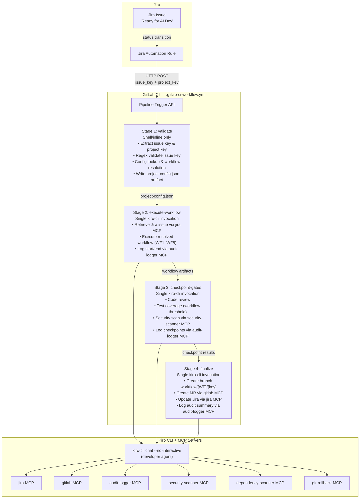
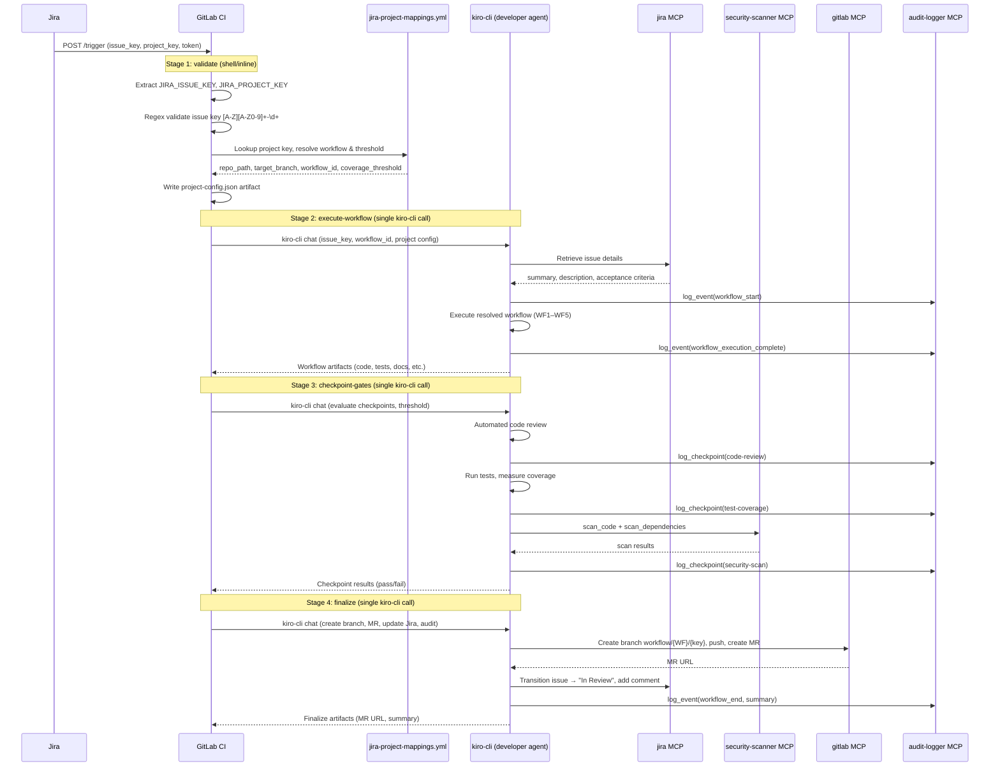

# Design Document: Jira-GitLab-Kiro Integration

## Overview

This design describes a simplified, workflow-agnostic integration between Jira, GitLab CI, and Kiro CLI. When a Jira issue transitions to a designated status, a webhook triggers a 4-stage GitLab pipeline (`.gitlab-ci-workflow.yml`) that validates the trigger, invokes Kiro CLI in headless mode to execute the resolved workflow (WF1–WF5), evaluates workflow-specific checkpoint gates, and finalizes by creating a merge request, updating Jira, and logging the audit trail.

The key simplification over the previous design: instead of 9 stages and a custom `scripts/wf1_pipeline/` Python module, the pipeline delegates nearly all operations to `kiro-cli chat --no-interactive` using the developer agent's pre-configured MCP servers (jira, gitlab, audit-logger, security-scanner, dependency-scanner, git-rollback). Only the `validate` stage uses shell/inline scripting. The remaining 3 stages are single Kiro CLI invocations.

### Key Design Decisions

1. **4-stage pipeline**: `validate` → `execute-workflow` → `checkpoint-gates` → `finalize`. Minimum stages needed; each has a clear responsibility boundary.
2. **No custom Python module**: The `scripts/wf1_pipeline/` package is eliminated. The `validate` stage uses shell + inline YAML/jq parsing. All other stages delegate to Kiro CLI MCP calls.
3. **Workflow-agnostic**: The pipeline file is `.gitlab-ci-workflow.yml` (not WF1-specific). The `validate` stage resolves the `Workflow_Identifier` from `config/jira-project-mappings.yml`, and downstream stages act on it generically.
4. **Workflow-specific coverage thresholds**: WF1 ≥80%, WF2 ≥80%, WF3 ≥70%, WF4 ≥90%, WF5 N/A. The threshold is resolved in `validate` and passed as an artifact.
5. **MCP-first**: Jira retrieval, MR creation, security scanning, dependency scanning, audit logging, and git-rollback are all performed by Kiro CLI via its configured MCP servers — no direct REST API calls from shell.
6. **Feature-branch isolation**: All commits go to `workflow/{WORKFLOW}/{JIRA_ISSUE_KEY_LOWER}`. The target branch is never directly modified.
7. **Existing retry-wrapper.sh**: Kiro CLI invocations are wrapped with `scripts/retry-wrapper.sh` (3 retries, exponential backoff).
8. **30-minute pipeline timeout**: Global timeout prevents runaway pipelines.
9. **Conditional include**: `.gitlab-ci.yml` includes `.gitlab-ci-workflow.yml` only when `$JIRA_ISSUE_KEY` is present, keeping the existing lint/test/security/deploy stages unaffected.

## Architecture



### Pipeline Sequence Diagram



## Components and Interfaces

### 1. Project Mapping Configuration (`config/jira-project-mappings.yml`)

Unchanged from the existing file. Maps Jira project keys to repo paths, target branches, workflow identifiers, and defaults. The `validate` stage reads this file using shell/yq/inline parsing.

The config is extended to support a `workflow` field per project that accepts any valid Workflow_Identifier (`wf1-requirement-to-software`, `wf2-autonomous-refactoring`, `wf3-dependency-upgrades`, `wf4-bug-fix`, `wf5-documentation`). The `validate` stage resolves the workflow and maps it to the corresponding coverage threshold.

### 2. `.gitlab-ci-workflow.yml` Pipeline Configuration

The dedicated workflow pipeline file. Included conditionally from `.gitlab-ci.yml` when `$JIRA_ISSUE_KEY` is present.

```yaml
# .gitlab-ci-workflow.yml — Workflow-agnostic Jira-triggered pipeline
workflow:
  rules:
    - if: '$JIRA_ISSUE_KEY'
      when: always
    - when: never

default:
  image: python:3.11
  timeout: 30 minutes

stages:
  - validate
  - execute-workflow
  - checkpoint-gates
  - finalize

# --- Stage 1: validate ---
validate:
  stage: validate
  script:
    - |
      # Extract and validate JIRA_ISSUE_KEY
      if [ -z "$JIRA_ISSUE_KEY" ]; then
        echo "ERROR: JIRA_ISSUE_KEY is not set"; exit 1
      fi
      if ! echo "$JIRA_ISSUE_KEY" | grep -qE '^[A-Z][A-Z0-9]+-[0-9]+$'; then
        echo "ERROR: Invalid JIRA_ISSUE_KEY format: $JIRA_ISSUE_KEY"; exit 1
      fi

      # Extract project key from issue key
      PROJECT_KEY="${JIRA_PROJECT_KEY:-$(echo "$JIRA_ISSUE_KEY" | sed 's/-[0-9]*$//')}"

      # Lookup project in config (requires yq or python inline)
      pip install pyyaml -q
      python3 -c "
      import yaml, json, sys
      VALID_WORKFLOWS = [
        'wf1-requirement-to-software', 'wf2-autonomous-refactoring',
        'wf3-dependency-upgrades', 'wf4-bug-fix', 'wf5-documentation'
      ]
      COVERAGE_THRESHOLDS = {
        'wf1-requirement-to-software': 80,
        'wf2-autonomous-refactoring': 80,
        'wf3-dependency-upgrades': 70,
        'wf4-bug-fix': 90,
        'wf5-documentation': None
      }
      with open('config/jira-project-mappings.yml') as f:
          config = yaml.safe_load(f)
      defaults = config.get('defaults', {})
      projects = config.get('projects', {})
      key = '$PROJECT_KEY'
      if key not in projects:
          print(f'ERROR: Project key {key} not found in config'); sys.exit(1)
      proj = {**defaults, **projects[key]}
      if not proj.get('repo_path') or not proj.get('target_branch'):
          print('ERROR: repo_path and target_branch are required'); sys.exit(1)
      wf = proj.get('workflow', defaults.get('workflow', ''))
      if wf not in VALID_WORKFLOWS:
          print(f'ERROR: Invalid workflow: {wf}. Valid: {VALID_WORKFLOWS}'); sys.exit(1)
      proj['workflow'] = wf
      proj['coverage_threshold'] = COVERAGE_THRESHOLDS[wf]
      proj['jira_issue_key'] = '$JIRA_ISSUE_KEY'
      proj['jira_project_key'] = key
      import os; os.makedirs('validate-output', exist_ok=True)
      with open('validate-output/project-config.json', 'w') as f:
          json.dump(proj, f, indent=2)
      print(f'Resolved: workflow={wf}, repo={proj[\"repo_path\"]}, threshold={proj[\"coverage_threshold\"]}')
      "
  artifacts:
    paths:
      - validate-output/
    expire_in: 1 hour

# --- Stage 2: execute-workflow ---
execute-workflow:
  stage: execute-workflow
  needs:
    - job: validate
      artifacts: true
  script:
    - |
      CONFIG=$(cat validate-output/project-config.json)
      WORKFLOW=$(echo "$CONFIG" | python3 -c "import sys,json; print(json.load(sys.stdin)['workflow'])")
      REPO_PATH=$(echo "$CONFIG" | python3 -c "import sys,json; print(json.load(sys.stdin)['repo_path'])")
    - >-
      scripts/retry-wrapper.sh
      "kiro-cli chat --no-interactive -a
      'You are the developer agent. Execute workflow ${WORKFLOW} for Jira issue ${JIRA_ISSUE_KEY}.
      1. Retrieve the Jira issue details via the jira MCP server.
      2. Log workflow start via audit-logger MCP (include issue key, workflow ID, pipeline ${CI_PIPELINE_ID}).
      3. Execute the ${WORKFLOW} workflow against repo path ${REPO_PATH}.
      4. Log workflow execution complete via audit-logger MCP.
      Save all output artifacts to workflow-output/.'"
    - mkdir -p workflow-output
  artifacts:
    paths:
      - validate-output/
      - workflow-output/
    expire_in: 1 hour

# --- Stage 3: checkpoint-gates ---
checkpoint-gates:
  stage: checkpoint-gates
  needs:
    - job: validate
      artifacts: true
    - job: execute-workflow
      artifacts: true
  script:
    - |
      CONFIG=$(cat validate-output/project-config.json)
      THRESHOLD=$(echo "$CONFIG" | python3 -c "import sys,json; print(json.load(sys.stdin).get('coverage_threshold','null'))")
      WORKFLOW=$(echo "$CONFIG" | python3 -c "import sys,json; print(json.load(sys.stdin)['workflow'])")
      REPO_PATH=$(echo "$CONFIG" | python3 -c "import sys,json; print(json.load(sys.stdin)['repo_path'])")
    - >-
      scripts/retry-wrapper.sh
      "kiro-cli chat --no-interactive -a
      'You are the developer agent. Evaluate checkpoint gates for Jira issue ${JIRA_ISSUE_KEY} (workflow: ${WORKFLOW}).
      1. Perform automated code review of AI-generated artifacts in ${REPO_PATH}. Log result via audit-logger MCP.
      2. Run the test suite and measure line coverage. Required threshold: ${THRESHOLD}%. If workflow is wf5-documentation, skip coverage. Log result via audit-logger MCP.
      3. Run security-scanner MCP scan_code and scan_dependencies on ${REPO_PATH}. Fail if any HIGH or CRITICAL vulnerabilities. Log result via audit-logger MCP.
      4. Write checkpoint results to checkpoint-output/checkpoint-results.json.
      If any checkpoint fails, exit with non-zero code and include failure details.'"
    - mkdir -p checkpoint-output
  artifacts:
    paths:
      - validate-output/
      - workflow-output/
      - checkpoint-output/
    expire_in: 1 hour

# --- Stage 4: finalize ---
finalize:
  stage: finalize
  needs:
    - job: validate
      artifacts: true
    - job: execute-workflow
      artifacts: true
    - job: checkpoint-gates
      artifacts: true
  script:
    - |
      CONFIG=$(cat validate-output/project-config.json)
      TARGET_BRANCH=$(echo "$CONFIG" | python3 -c "import sys,json; print(json.load(sys.stdin)['target_branch'])")
      WORKFLOW=$(echo "$CONFIG" | python3 -c "import sys,json; print(json.load(sys.stdin)['workflow'])")
    - >-
      scripts/retry-wrapper.sh
      "kiro-cli chat --no-interactive -a
      'You are the developer agent. Finalize workflow for Jira issue ${JIRA_ISSUE_KEY} (workflow: ${WORKFLOW}).
      1. Create branch ai/${JIRA_ISSUE_KEY}, commit all AI-generated artifacts, push to remote.
      2. Create a merge request via gitlab MCP targeting branch ${TARGET_BRANCH}. Title: \"${JIRA_ISSUE_KEY}: [issue summary]\". Description: include Jira issue summary, link, workflow ID, and change summary.
      3. Transition Jira issue to \"In Review\" via jira MCP. Add comment with pipeline URL and MR link.
      4. Log complete workflow summary to audit-logger MCP (workflow ID, checkpoint outcomes, branch, MR URL).
      5. Write finalize-output/pipeline-summary.json with issue key, workflow, branch, MR URL, checkpoint results.
      If Jira status update fails, log the failure and continue.'"
    - mkdir -p finalize-output
  artifacts:
    paths:
      - finalize-output/
    expire_in: 1 week
```

#### `.gitlab-ci.yml` Integration

The main pipeline includes the workflow pipeline conditionally:

```yaml
# In .gitlab-ci.yml — add this include block
include:
  - local: '.gitlab-ci-workflow.yml'
    rules:
      - if: '$JIRA_ISSUE_KEY'
```

This replaces the old `.gitlab-ci-wf1.yml` include. When `$JIRA_ISSUE_KEY` is not present, the existing lint/test/security/deploy stages run normally.

### 3. Validate Stage (Shell/Inline)

The only stage that uses shell scripting. Responsibilities:
- Extract `JIRA_ISSUE_KEY` and `JIRA_PROJECT_KEY` from CI trigger variables
- Regex-validate the issue key against `^[A-Z][A-Z0-9]+-[0-9]+$`
- Load `config/jira-project-mappings.yml` and look up the project key
- Resolve the `Workflow_Identifier` (from project-specific or defaults)
- Validate the workflow identifier against the allowed list
- Map the workflow to its coverage threshold
- Write `validate-output/project-config.json` artifact for downstream stages

No Kiro CLI invocation. No MCP calls. Pure validation.

### 4. Execute-Workflow Stage (Single Kiro CLI Call)

A single `kiro-cli chat --no-interactive` invocation that:
- Receives the `JIRA_ISSUE_KEY`, resolved `Workflow_Identifier`, and project config
- Retrieves Jira issue details via the jira MCP server
- Logs workflow start via audit-logger MCP
- Executes the resolved workflow (WF1–WF5) against the target repo path
- Logs workflow execution complete via audit-logger MCP
- Produces workflow-specific output artifacts in `workflow-output/`

The prompt instructs Kiro CLI which workflow to run. The developer agent's MCP servers handle all external interactions.

### 5. Checkpoint-Gates Stage (Single Kiro CLI Call)

A single `kiro-cli chat --no-interactive` invocation that sequentially evaluates:
1. **Code review**: Automated review of AI-generated artifacts for correctness, conventions, security
2. **Test coverage**: Run test suite, measure line coverage, compare against workflow-specific threshold
3. **Security scan**: Invoke security-scanner MCP `scan_code` and `scan_dependencies`

Each checkpoint result is logged to audit-logger MCP. If any checkpoint fails, the stage exits non-zero and the pipeline halts.

**Workflow-specific coverage thresholds:**

| Workflow | Threshold | Additional Checks |
|----------|-----------|-------------------|
| WF1 (Requirement to Software) | ≥80% | — |
| WF2 (Autonomous Refactoring) | ≥80% | All pre-existing tests pass |
| WF3 (Dependency Upgrades) | ≥70% | Full test suite passes post-upgrade |
| WF4 (Bug Fix) | ≥90% | Fix + regression tests |
| WF5 (Documentation) | N/A (skip) | — |

### 6. Finalize Stage (Single Kiro CLI Call)

A single `kiro-cli chat --no-interactive` invocation that:
- Creates branch `workflow/{WORKFLOW}/{JIRA_ISSUE_KEY_LOWER}`, commits artifacts, pushes to remote
- Creates a GitLab merge request via gitlab MCP (title includes issue key, description includes Jira link, workflow ID, change summary)
- Transitions Jira issue to "In Review" via jira MCP, adds comment with pipeline URL and MR link
- Logs complete workflow summary to audit-logger MCP
- Writes `finalize-output/pipeline-summary.json` artifact

If Jira status update fails, the failure is logged but does not block the pipeline.

### 7. Failure Handler (Pipeline-Level)

When any stage fails:
- GitLab CI halts subsequent stages automatically (default behavior with `needs` dependencies)
- The `finalize` stage is skipped
- A separate failure-handling mechanism (GitLab CI `after_script` or a `when: on_failure` job) invokes Kiro CLI to:
  - Transition Jira issue to "AI Dev Failed" via jira MCP
  - Add a comment with the pipeline URL and failure details
  - Log the failure to audit-logger MCP

```yaml
# Failure handler job in .gitlab-ci-workflow.yml
on-failure:
  stage: finalize
  when: on_failure
  needs:
    - job: validate
      artifacts: true
  script:
    - >-
      kiro-cli chat --no-interactive -a
      "Jira issue ${JIRA_ISSUE_KEY} pipeline failed.
      1. Transition issue to 'AI Dev Failed' via jira MCP.
      2. Add comment with pipeline URL ${CI_PIPELINE_URL} and failure details.
      3. Log failure to audit-logger MCP."
  allow_failure: true
```

## Data Models

### Project Configuration Artifact (`validate-output/project-config.json`)

Produced by the `validate` stage. Consumed by all downstream stages.

```typescript
interface ProjectConfig {
  jira_issue_key: string;        // e.g., "PROJ-123"
  jira_project_key: string;      // e.g., "PROJ"
  repo_path: string;             // e.g., "sample-app/java-module"
  target_branch: string;         // e.g., "main"
  workflow: string;              // e.g., "wf1-requirement-to-software"
  agent: string;                 // e.g., "developer"
  trigger_status: string;        // e.g., "Ready for AI Dev"
  timeout_minutes: number;       // e.g., 30
  coverage_threshold: number | null; // e.g., 80, 70, 90, or null for WF5
}
```

### Checkpoint Results Artifact (`checkpoint-output/checkpoint-results.json`)

Produced by the `checkpoint-gates` stage.

```typescript
interface CheckpointResults {
  code_review: {
    passed: boolean;
    details: string;
    issues_count: number;
  };
  test_coverage: {
    passed: boolean;
    coverage_percent: number;
    threshold: number | null;
    skipped: boolean;            // true for WF5
  };
  security_scan: {
    passed: boolean;
    findings_count: number;
    critical_count: number;      // HIGH + CRITICAL
    details: string;
  };
  overall_passed: boolean;
}
```

### Pipeline Summary Artifact (`finalize-output/pipeline-summary.json`)

Produced by the `finalize` stage.

```typescript
interface PipelineSummary {
  pipeline_id: string;
  jira_issue_key: string;
  jira_project_key: string;
  workflow: string;              // Workflow_Identifier
  trigger_timestamp: string;     // ISO 8601
  completion_timestamp: string;  // ISO 8601
  overall_outcome: "success" | "failure";
  checkpoints: CheckpointResults;
  branch_name: string;           // e.g., "workflow/wf1-requirement-to-software/proj-123"
  mr_url: string | null;        // GitLab MR URL, null on failure
  mr_title: string | null;
}
```

### Project Mapping Configuration Schema

```yaml
# config/jira-project-mappings.yml
defaults:
  workflow: string              # Valid Workflow_Identifier
  agent: string                 # Kiro agent role
  trigger_status: string        # Jira status that fires webhook
  timeout_minutes: integer      # Pipeline timeout

projects:
  <JIRA_PROJECT_KEY>:
    repo_path: string           # Required
    target_branch: string       # Required
    workflow: string            # Optional, overrides default
    agent: string               # Optional, overrides default
    trigger_status: string      # Optional, overrides default
    timeout_minutes: integer    # Optional, overrides default
```

### Coverage Threshold Mapping

```typescript
const COVERAGE_THRESHOLDS: Record<string, number | null> = {
  "wf1-requirement-to-software": 80,
  "wf2-autonomous-refactoring": 80,
  "wf3-dependency-upgrades": 70,
  "wf4-bug-fix": 90,
  "wf5-documentation": null     // No coverage check
};
```

### Valid Workflow Identifiers

```typescript
const VALID_WORKFLOWS = [
  "wf1-requirement-to-software",
  "wf2-autonomous-refactoring",
  "wf3-dependency-upgrades",
  "wf4-bug-fix",
  "wf5-documentation"
] as const;
```

## Correctness Properties

*A property is a characteristic or behavior that should hold true across all valid executions of a system — essentially, a formal statement about what the system should do. Properties serve as the bridge between human-readable specifications and machine-verifiable correctness guarantees.*

### Property 1: Config Validation Completeness

*For any* project mapping configuration YAML and *for any* project entry within it, the config validator shall accept the configuration if and only if every project entry has non-empty `repo_path` and `target_branch` fields (either directly specified or resolved from defaults) and a valid `workflow` identifier. Configurations missing any required field or containing an invalid workflow shall be rejected.

**Validates: Requirements 1.2, 1.3, 1.4, 1.6**

### Property 2: Default Value Application

*For any* project mapping configuration with a `defaults` section and *for any* project entry that omits optional fields (`workflow`, `agent`, `trigger_status`, `timeout_minutes`), the resolved configuration for that project entry shall contain the corresponding default values for all omitted fields, and the resolved JSON artifact shall include all required fields.

**Validates: Requirements 1.7, 3.7, 3.8**

### Property 3: Unmapped Project Key Rejection

*For any* project key string that does not exist in the `projects` map of the project mapping configuration, the project lookup function shall return a rejection/error result with a descriptive message.

**Validates: Requirements 1.5, 3.5, 3.6**

### Property 4: Workflow Identifier Validation

*For any* string, the workflow identifier validator shall accept it if and only if it is one of the five valid identifiers (`wf1-requirement-to-software`, `wf2-autonomous-refactoring`, `wf3-dependency-upgrades`, `wf4-bug-fix`, `wf5-documentation`). All other strings shall be rejected with a descriptive error listing the valid values.

**Validates: Requirements 1.8, 1.9**

### Property 5: Issue Key Pattern Validation

*For any* string, the issue key validator shall accept it if and only if it matches the regex pattern `^[A-Z][A-Z0-9]+-[0-9]+$`. All non-matching strings (including empty strings, lowercase strings, strings without a numeric suffix) shall be rejected.

**Validates: Requirements 3.3, 3.4**

### Property 6: Exit Code Classification

*For any* integer exit code from a Kiro CLI invocation, the exit code handler shall classify it as success if and only if the exit code is 0, and as failure for all non-zero exit codes.

**Validates: Requirements 4.10**

### Property 7: Coverage Threshold Mapping

*For any* valid workflow identifier, the threshold resolver shall return the correct coverage threshold: 80 for `wf1-requirement-to-software`, 80 for `wf2-autonomous-refactoring`, 70 for `wf3-dependency-upgrades`, 90 for `wf4-bug-fix`, and null (skip) for `wf5-documentation`.

**Validates: Requirements 5.3, 5.4, 5.5, 5.6, 5.7, 5.8**

### Property 8: Coverage Gate Evaluation

*For any* measured line coverage percentage (0–100) and *for any* workflow-specific coverage threshold, the coverage gate shall pass if and only if the coverage is greater than or equal to the threshold. When the threshold is null (WF5), the gate shall always pass (skip).

**Validates: Requirements 5.9**

### Property 9: Security Severity Gate

*For any* set of security scan findings, the security scan gate shall fail if and only if at least one finding has severity "HIGH" or "CRITICAL". A set with only "MEDIUM", "LOW", or "INFO" findings shall pass. An empty set shall pass.

**Validates: Requirements 5.11**

### Property 10: Code Review Gate

*For any* code review result, the code review gate shall fail if and only if the result contains one or more blocking issues. A result with zero blocking issues shall pass.

**Validates: Requirements 5.13**

### Property 11: Branch Naming and Isolation

*For any* valid Jira issue key (matching `[A-Z][A-Z0-9]+-[0-9]+`) and valid workflow identifier, the branch name generator shall produce a branch name exactly equal to `workflow/{WORKFLOW}/{issue_key_lower}`. No commits shall target any other branch.

**Validates: Requirements 6.1, 10.6**

### Property 12: Merge Request Content Completeness

*For any* Jira issue key, issue summary, Jira issue URL, workflow identifier, and project configuration, the generated merge request shall have: (a) a title containing the Jira issue key, (b) a target branch matching the project configuration's `target_branch`, and (c) a description containing the issue summary, a link to the Jira issue, and the workflow identifier.

**Validates: Requirements 6.4, 6.5**

### Property 13: Bidirectional Jira Status Transition

*For any* pipeline execution, if the pipeline completes successfully with a merge request created, the Jira issue status shall be transitioned to "In Review". If the pipeline fails at any stage, the Jira issue status shall be transitioned to "AI Dev Failed". In both cases, a comment containing the pipeline URL shall be added.

**Validates: Requirements 7.1, 7.2, 7.3, 10.2, 10.3**

### Property 14: Input Sanitization

*For any* input string containing shell metacharacters (`` $ ` \ " ! | ; & ( ) ``), HTML tags, or common prompt injection patterns, the sanitizer shall produce an output string where all dangerous characters are escaped or removed. The sanitized output shall not be executable as a shell command or prompt injection.

**Validates: Requirements 8.5**

### Property 15: Audit Record Completeness

*For any* Jira-triggered workflow execution, the audit log shall contain: (a) a workflow start event with `jira_issue_key`, `jira_project_key`, `workflow_identifier`, `pipeline_id`, `trigger_timestamp`, and `initiator`; (b) a workflow end event with `outcome`, `workflow_identifier`, `duration`, and artifact references; and (c) the `workflow_run_id` field shall contain the Jira issue key for traceability.

**Validates: Requirements 9.1, 9.2, 9.4**

### Property 16: Checkpoint Audit Logging

*For any* checkpoint gate evaluation (code-review, test-coverage, or security-scan), the audit log shall contain a checkpoint record with the checkpoint name, pass/fail result, evaluation details, and the workflow-specific threshold that was applied.

**Validates: Requirements 9.3**

### Property 17: Pipeline Summary Completeness

*For any* completed pipeline execution (success or failure), the pipeline summary artifact shall contain the Jira issue key, workflow identifier, pipeline ID, per-checkpoint outcomes, and overall outcome. On success, it shall additionally contain the branch name and merge request URL.

**Validates: Requirements 9.5**

### Property 18: Pipeline Halt on Failure

*For any* pipeline stage that fails, all subsequent stages shall be skipped. The pipeline shall not proceed past a failed stage.

**Validates: Requirements 11.8**

## Error Handling

### Error Handling Strategy

The integration uses fail-fast semantics with feature-branch isolation. Each stage either succeeds completely or fails the pipeline. On failure, Kiro CLI updates Jira and logs to audit before halting.

### Stage-Level Error Pattern

Every stage follows the same pattern:
1. **Detect failure** — non-zero exit code, missing artifact, validation error
2. **Log to audit** — Kiro CLI logs failure via audit-logger MCP (except `validate`, which has no Kiro CLI access)
3. **Update Jira** — Kiro CLI transitions issue to "AI Dev Failed" via jira MCP (via `on-failure` job)
4. **Halt pipeline** — exit non-zero; GitLab CI skips all subsequent stages

### Error Categories and Responses

| Error Category | Stage | Response | Recovery |
|---------------|-------|----------|----------|
| Missing/invalid `JIRA_ISSUE_KEY` | validate | Fail with descriptive error | Fix Jira automation rule |
| Unmapped project key | validate | Fail with descriptive error | Add project to `config/jira-project-mappings.yml` |
| Invalid Workflow_Identifier | validate | Fail listing valid identifiers | Fix workflow field in config |
| Config missing required fields | validate | Fail with field-level error | Fix config YAML |
| Kiro CLI non-zero exit (after 3 retries) | execute-workflow | Fail pipeline, `on-failure` job updates Jira | Check Kiro CLI installation, agent config, MCP servers |
| Code review blocking issues | checkpoint-gates | Fail pipeline with review details | Fix code issues, re-trigger |
| Coverage below threshold | checkpoint-gates | Fail with actual vs. required % | Add tests, re-trigger |
| HIGH/CRITICAL vulnerabilities | checkpoint-gates | Fail with vulnerability report | Fix vulnerabilities, re-trigger |
| Branch/push failure | finalize | Fail pipeline, log to audit | Check Git permissions |
| MR creation failure | finalize | Log failure, update Jira with partial completion | Manually create MR from pushed branch |
| Jira status update failure | finalize / on-failure | Log to audit, continue (non-blocking) | Manually update Jira |
| Pipeline timeout (30 min) | any | GitLab CI terminates pipeline | Investigate slow stage, increase timeout if needed |

### Retry Strategy

- **Kiro CLI invocations** (stages 2, 3, 4): Wrapped with `scripts/retry-wrapper.sh` — 3 retries, exponential backoff (10s, 20s, 40s)
- **Validate stage**: No retry (shell validation is deterministic)
- **Jira status updates**: No retry (non-blocking; failure logged to audit)

### Feature Branch Isolation

All AI-generated code is committed exclusively to `workflow/{WORKFLOW}/{JIRA_ISSUE_KEY_LOWER}` branches. The target branch is never directly modified. This ensures:
- Failed pipelines leave no partial code on the target branch
- Concurrent pipeline runs for different Jira issues do not conflict
- Cleanup is limited to deleting the feature branch if needed

### Failure Job

A dedicated `on-failure` job runs when any stage fails. It invokes Kiro CLI to transition the Jira issue to "AI Dev Failed" and log the failure to audit-logger MCP. This job uses `allow_failure: true` so it doesn't mask the original failure.

## Testing Strategy

### Dual Testing Approach

The integration requires both unit tests and property-based tests:

- **Unit tests**: Verify specific examples, edge cases, error conditions, and integration points
- **Property-based tests**: Verify universal properties across all valid inputs using randomized generation

Both are complementary. Unit tests catch concrete bugs at known boundaries. Property tests verify general correctness across the input space.

### Property-Based Testing Library

**Library**: [Hypothesis](https://hypothesis.readthedocs.io/) (Python)

All testable logic (config validation, issue key validation, threshold mapping, gate evaluation, branch naming, MR content, sanitization) is implemented in Python, consistent with the existing MCP servers and pytest infrastructure.

**Configuration**: Each property test runs a minimum of 100 iterations (`@settings(max_examples=100)`).

**Tagging**: Each property test includes a comment referencing the design property:
```python
# Feature: jira-gitlab-kiro-integration, Property 1: Config Validation Completeness
```

Each correctness property is implemented by a single property-based test.

### Unit Test Coverage

Unit tests target specific examples, edge cases, and integration points:

| Test Area | Examples |
|-----------|----------|
| Config loading | Valid YAML parses correctly; missing file raises error |
| Config validation | Specific valid/invalid configs with known outcomes |
| Issue key validation | Known valid keys ("PROJ-123", "AB-1"), known invalid keys ("proj-123", "", "123-ABC") |
| Workflow validation | Each of the 5 valid IDs accepted; "wf6-unknown" rejected |
| Threshold mapping | Each workflow maps to correct threshold; WF5 maps to null |
| Coverage gate | 79.9% → fail, 80.0% → pass, null threshold → skip |
| Security gate | Empty findings → pass, LOW only → pass, one HIGH → fail |
| Branch naming | "PROJ-123" → "workflow/wf1-requirement-to-software/proj-123" |
| MR content | Specific issue data produces MR with correct title and description |
| Sanitization | Known dangerous inputs (`` $(rm -rf /) ``, `` '; DROP TABLE; ``) are neutralized |
| Jira status | Success → "In Review", failure → "AI Dev Failed" |
| Audit records | Specific workflow data produces records with all required fields |
| Pipeline summary | Specific pipeline data produces summary with all required fields |
| Error paths | Missing JIRA_ISSUE_KEY, unmapped project, invalid workflow ID |
| Pipeline YAML | `.gitlab-ci-workflow.yml` defines exactly 4 stages in correct order |

### Property-Based Test Coverage

Each correctness property maps to a single property-based test:

| Property | Test Description | Generator Strategy |
|----------|-----------------|-------------------|
| P1: Config Validation | Generate random configs with/without required fields, verify validator accepts/rejects correctly | Random YAML structures with optional field omission |
| P2: Default Application | Generate configs with defaults and partial project entries, verify resolved config has defaults | Random defaults + random project entries with field omission |
| P3: Unmapped Key Rejection | Generate configs and random keys not in the projects map, verify rejection | Random strings not matching any project key |
| P4: Workflow ID Validation | Generate random strings, verify accept/reject matches valid list | Mix of valid workflow IDs and arbitrary strings |
| P5: Issue Key Validation | Generate random strings, verify accept/reject matches regex | Mix of valid pattern strings and arbitrary strings |
| P6: Exit Code Classification | Generate random integers, verify 0→success, non-zero→failure | Random integers including 0, positive, negative |
| P7: Threshold Mapping | Generate valid workflow IDs, verify correct threshold returned | Draw from the 5 valid workflow identifiers |
| P8: Coverage Gate | Generate random coverage % and thresholds, verify pass/fail | Random floats in [0, 100] × random thresholds |
| P9: Security Gate | Generate random finding sets with various severities, verify gate | Lists of findings with random severity levels |
| P10: Code Review Gate | Generate random review results with/without blocking issues, verify gate | Random review results with issue counts |
| P11: Branch Naming | Generate valid issue keys, verify branch name = `workflow/{wf}/{key_lower}` | Strings matching `[A-Z][A-Z0-9]+-[0-9]+` |
| P12: MR Content | Generate random issue data and config, verify MR contains required elements | Random strings for key, summary, URL, workflow |
| P13: Jira Status Transition | Generate success/failure outcomes, verify correct Jira transition | Boolean success flag + random pipeline data |
| P14: Sanitization | Generate strings with shell metacharacters, verify safe output | Random strings seeded with dangerous characters |
| P15: Audit Completeness | Generate random workflow data, verify audit records contain required fields | Random strings for all workflow metadata fields |
| P16: Checkpoint Logging | Generate random checkpoint results, verify audit record content | Random checkpoint names, pass/fail, thresholds |
| P17: Summary Completeness | Generate random pipeline results, verify summary contains required fields | Random stage results, checkpoint results, MR data |
| P18: Pipeline Halt | Generate stage failure at random positions, verify subsequent stages skipped | Random stage index + random pipeline state |

### Test File Organization

```
tests/
├── test_config_validation.py       # Unit + property tests for config loading/validation (P1, P2, P3, P4)
├── test_issue_key_validation.py    # Unit + property tests for issue key validation (P5)
├── test_exit_code_handler.py       # Unit + property tests for exit code handling (P6)
├── test_threshold_mapping.py       # Unit + property tests for coverage threshold mapping (P7)
├── test_checkpoint_gates.py        # Unit + property tests for coverage, security, code review gates (P8, P9, P10)
├── test_branch_naming.py           # Unit + property tests for branch naming (P11)
├── test_merge_request.py           # Unit + property tests for MR content (P12)
├── test_jira_status.py             # Unit + property tests for Jira status transitions (P13)
├── test_sanitizer.py               # Unit + property tests for input sanitization (P14)
├── test_audit_logging.py           # Unit + property tests for audit record completeness (P15, P16)
└── test_pipeline_summary.py        # Unit + property tests for summary artifact and halt behavior (P17, P18)
```
