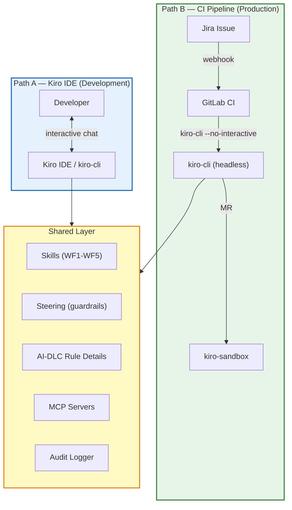
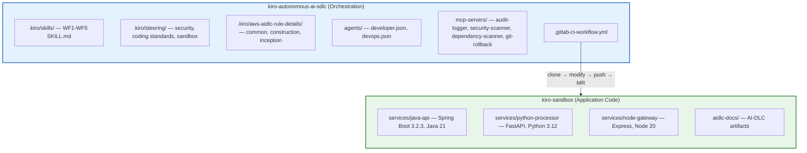
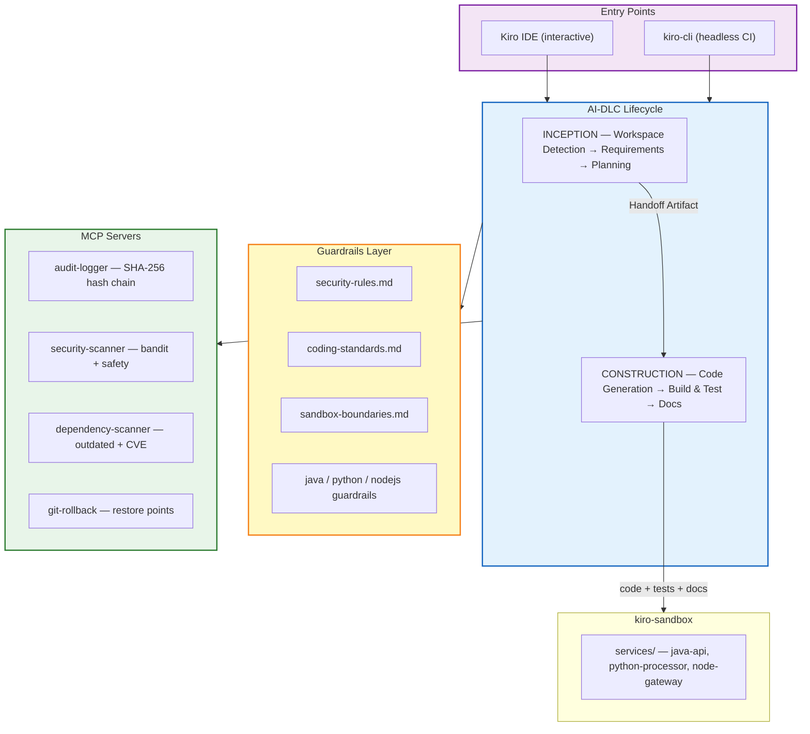
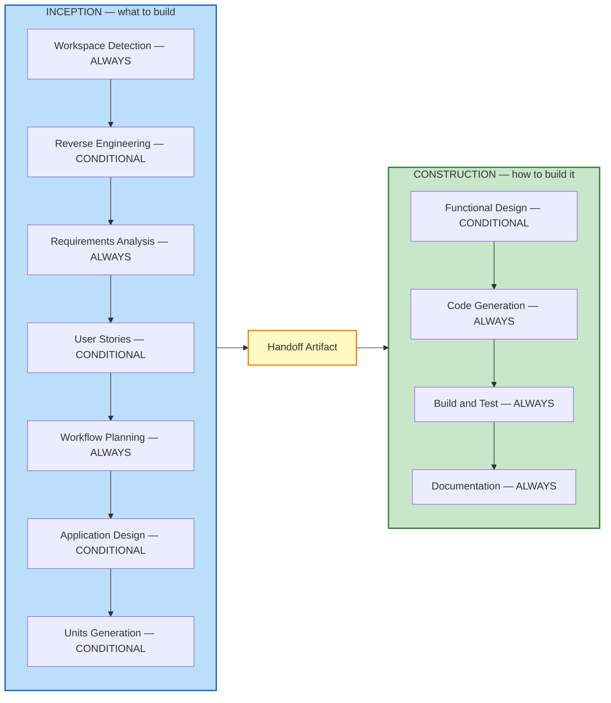
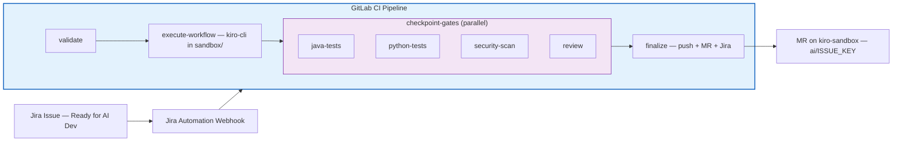
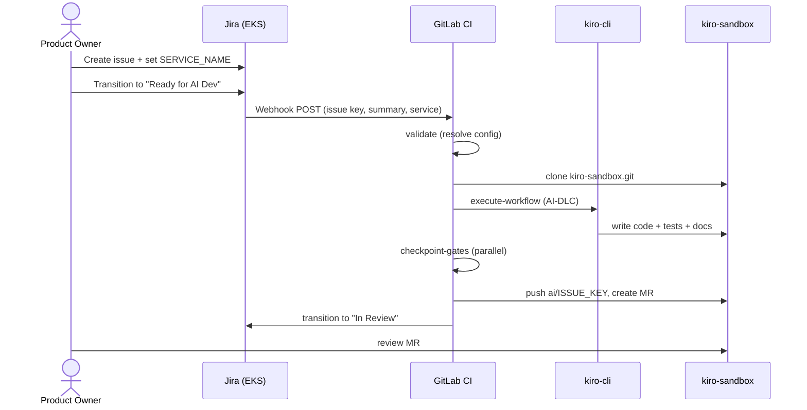
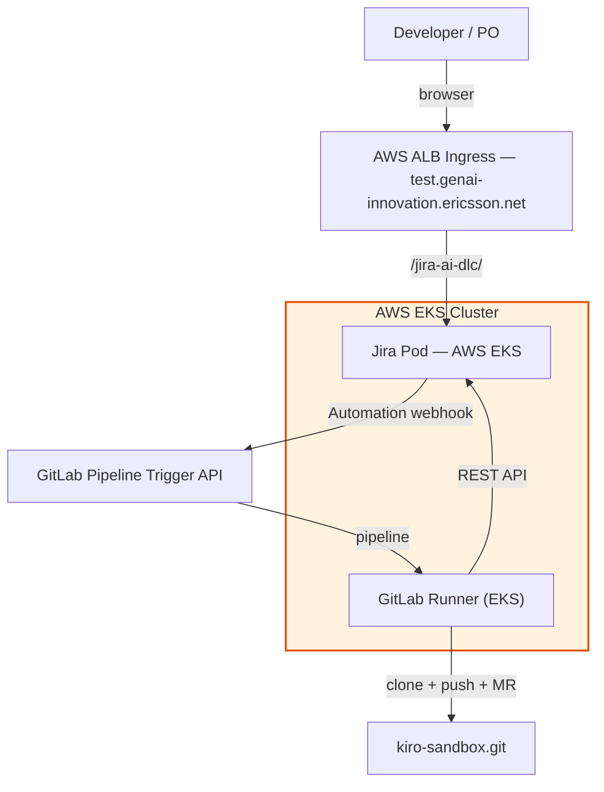
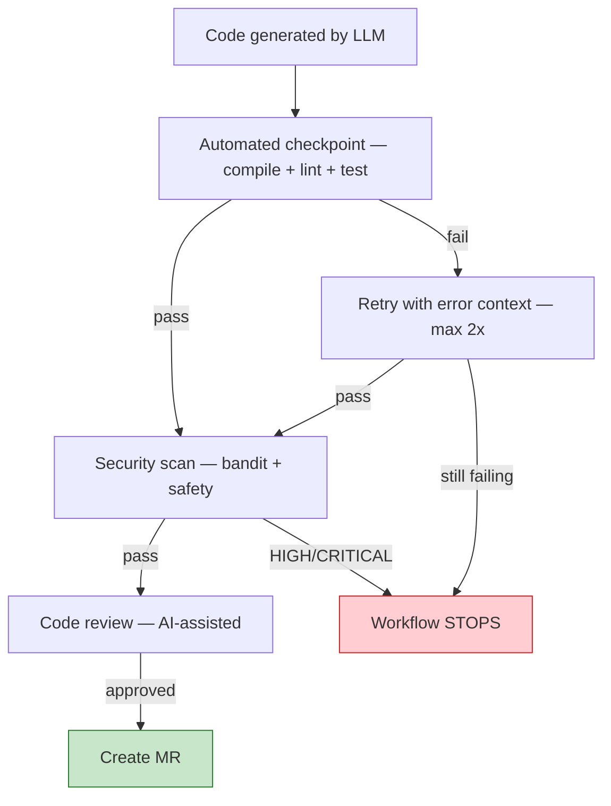

# Architecture — Autonomous AI Software Development Lifecycle

> **Status:** Live | **Last Updated:** 2026-03-31 | **Owner:** GenAI Innovation Team

This system transforms natural language requirements (Jira tickets) into working, tested, documented code — delivered as merge requests — with full audit trails and safety guardrails.

The architecture uses [Kiro](https://kiro.dev) native primitives (Skills, Steering, Hooks, Agents, MCP servers) with AI-DLC (AI-Driven Development Lifecycle) for structured requirements-to-code execution. No custom workflow engine is required.

> **Key URLs:**
> - Jira: [https://test.genai-innovation.ericsson.net/jira-ai-dlc/](https://test.genai-innovation.ericsson.net/jira-ai-dlc/)
> - Orchestration Repo: [kiro-autonomous-ai-sdlc](https://gitlab.internal.ericsson.com/san-tools-technology-platform/genai-innovation/ai-streams/developer/kiro-autonomous-ai-sdlc)
> - Sandbox Repo: [kiro-sandbox](https://gitlab.internal.ericsson.com/san-tools-technology-platform/genai-innovation/ai-streams/developer/kiro-sandbox)

---

## 1. System Overview

The system operates through two complementary paths:

| Path | Use Case | Entry Point | Human Involvement |
|---|---|---|---|
| **Path A — Kiro IDE** | Exploratory, novel, complex tasks | Developer ↔ Kiro IDE | Interactive review in IDE |
| **Path B — CI Pipeline** | Well-patterned features, bulk tickets | Jira → GitLab CI → kiro-cli | MR approval only |

Both paths share the same workflow skills, guardrails, AI-DLC rules, and audit system.



---

## 2. Architecture

### 2.1 Two-Repository Model

| Repository | Purpose |
|---|---|
| **kiro-autonomous-ai-sdlc** | Orchestration — pipeline, agents, skills, steering, MCP servers, AI-DLC rules |
| **kiro-sandbox** | Application code — services modified by the AI, plus AI-DLC artifacts |




### 2.2 Kiro Primitive Mapping

Every component maps to a Kiro-native primitive — no custom engine code:

| Kiro Primitive | Files | SDLC Role |
|---|---|---|
| **Skills** | `.kiro/skills/developer-skills/wf{1-5}/SKILL.md` | Workflow definitions |
| **Steering** | `.kiro/steering/*.md` | Always-on guardrails + language-specific (fileMatch) |
| **Hooks** | `.kiro/hooks/*.json` | Event triggers (preToolUse, postTaskExecution) |
| **Agent configs** | `agents/developer.json`, `agents/devops.json` | Role-based routing with MCP bindings |
| **MCP servers** | `mcp-servers/*/server.py` | Infrastructure tooling via stdio |
| **AI-DLC rules** | `.kiro/aws-aidlc-rule-details/` | Phase rules loaded by WF skills |

### 2.3 Component Architecture



---

## 3. AI-DLC Lifecycle

AI-DLC (AI-Driven Development Lifecycle) is a structured two-phase process that adapts to request complexity.



**INCEPTION** analyzes the request, gathers requirements, and selects the appropriate workflow (WF1-WF5). It produces a Handoff Artifact consumed by CONSTRUCTION.

**CONSTRUCTION** is delegated to the selected WF skill, which generates code, tests, and documentation.

### 3.1 Shared Rule Details

Each WF skill loads rules from `.kiro/aws-aidlc-rule-details/` at startup:

| Rule File | Purpose |
|---|---|
| `common/verbosity-mode.md` | Silent/debug output control |
| `common/error-handling.md` | Error severity, recovery, escalation |
| `common/overconfidence-prevention.md` | Default to asking questions |
| `common/content-validation.md` | Validate content before writing |
| `common/depth-levels.md` | Adapt detail to complexity |
| `construction/code-generation.md` | Code location, brownfield rules, automation-friendly code |
| `construction/build-and-test.md` | Test strategy, instruction formats |
| `extensions/security/baseline/security-baseline.md` | 15 SECURITY rules (OWASP-mapped) |

---

## 4. Workflows

### 4.1 Available Workflows

| Workflow | Trigger | Coverage | Description |
|---|---|---|---|
| **WF1 — Requirement to Software** | New feature / enhancement | 80% | Requirement → design → code → tests → docs → MR |
| **WF2 — Autonomous Refactoring** | Technical debt | 80% | Analyze → refactor → verify behavior equivalence → benchmark |
| **WF3 — Dependency Upgrades** | Outdated / vulnerable deps | 70% | Scan → compatibility → upgrade → full test suite |
| **WF4 — Bug Fix** | Bug report / failing test | 90% | Root cause → fix → regression tests → side-effect analysis |
| **WF5 — Documentation** | Docs-only changes | N/A | Codebase analysis → generate docs |

### 4.2 WF1 — Requirement to Software (Primary)

```mermaid
flowchart LR
    REQ["Parse Requirement"]
    SPEC["Create Kiro Spec"]
    RP["Create Restore Point"]
    IMPL["Implement Tasks"]
    CR["Code Review ✓"]
    COV["Test Coverage ✓ ≥80%"]
    SEC["Security Scan ✓"]
    DOCS["Generate Docs"]
    MR["Merge"]

    REQ --> SPEC --> RP --> IMPL --> CR --> COV --> SEC --> DOCS --> MR

    style CR fill:#fff9c4,stroke:#f57f17
    style COV fill:#fff9c4,stroke:#f57f17
    style SEC fill:#fff9c4,stroke:#f57f17
```



### 4.3 Checkpoint Gates

All checkpoints must pass before merge:

| Checkpoint | Type | Criteria |
|---|---|---|
| **Code Review** | Automated + human | Correctness, conventions, no dead code |
| **Test Coverage** | Automated | WF1: 80%, WF2: 80%, WF3: 70%, WF4: 90% |
| **Security Scan** | Automated | No HIGH or CRITICAL findings |

> If any checkpoint fails: workflow stops, failure logged to audit, `git-rollback` MCP restores previous state.

---

## 5. CI/CD Pipeline

### 5.1 Pipeline Architecture



### 5.2 Pipeline Stages

| Stage | Image | Purpose |
|---|---|---|
| **validate** | kiro-ci | Resolve Jira project → service → workflow → coverage threshold |
| **execute-workflow** | kiro-ci | Clone kiro-sandbox, `cd sandbox`, run AI-DLC via kiro-cli |
| **java-tests** | maven:3.9-eclipse-temurin-21 | `mvn verify` + JaCoCo coverage |
| **python-tests** | python:3.12-slim | `pytest --cov` with per-file coverage |
| **security-scan** | python:3.12-slim | `bandit` + `safety` (blocks on HIGH/CRITICAL) |
| **review** | kiro-ci | AI-assisted code review via kiro-cli |
| **finalize** | kiro-ci | Push branch, create MR, transition Jira |
| **on-failure** | kiro-ci | Transition Jira to "AI Dev Failed" |

### 5.3 End-to-End Sequence



### 5.4 Retry and Recovery

| Layer | Mechanism | Detail |
|---|---|---|
| kiro-cli | `retry-wrapper.sh` | 3 retries, exponential backoff |
| GitLab job | `retry: max: 2` | Runner crashes, network timeouts |
| MR creation | HTTP 409 handler | Fetches existing MR URL |
| Rollback | `git-rollback` MCP | Restore point before implementation |

---

## 6. Jira Instance — AWS EKS

A dedicated Jira instance serves as the issue tracking frontend for the AI-DLC pipeline.

> **URL:** [https://test.genai-innovation.ericsson.net/jira-ai-dlc/](https://test.genai-innovation.ericsson.net/jira-ai-dlc/)



| Component | Detail |
|---|---|
| **Platform** | AWS EKS (Kubernetes) |
| **Project Key** | `QWE` |
| **Custom Fields** | `SERVICE_NAME` — java-api, python-processor, node-gateway |
| **Automation** | Issue → "Ready for AI Dev" → POST to GitLab trigger API |
| **Workflow** | To Do → Ready for AI Dev → In Review → Done |

---

## 7. Safety and Guardrails

### 7.1 Steering Files

| File | Inclusion | Scope |
|---|---|---|
| **security-rules.md** | Always | No hardcoded secrets, input validation, dependency scanning |
| **coding-standards.md** | Always | Code review, coverage thresholds, documentation standards |
| **sandbox-boundaries.md** | Always | No production access, sandbox-only resources |
| **java-guardrails.md** | fileMatch `*.java` | Java/Spring conventions |
| **python-guardrails.md** | fileMatch `*.py` | Python/FastAPI conventions |
| **nodejs-guardrails.md** | fileMatch `*.js`, `*.ts` | Node.js/TypeScript conventions |

### 7.2 Security Baseline (OWASP-Mapped)

15 SECURITY rules conditionally enforced via `aidlc-state.md`:

| Rule | Category |
|---|---|
| SECURITY-01 | Encryption at rest and in transit |
| SECURITY-05 | Input validation on all API parameters |
| SECURITY-08 | Application-level access control (A01:2025) |
| SECURITY-10 | Software supply chain security (A03:2025) |
| SECURITY-12 | Authentication and credential management (A07:2025) |
| SECURITY-15 | Exception handling and fail-safe defaults (A10:2025) |

### 7.3 Checkpoint Flow



---

## 8. MCP Servers

| Server | Purpose | Key Tools |
|---|---|---|
| **audit-logger** | Tamper-evident logging (SHA-256 hash chain) | `log_interaction`, `log_checkpoint`, `log_event`, `query_audit` |
| **security-scanner** | Static analysis + dependency CVE scanning | `scan_code`, `scan_dependencies`, `get_scan_report` |
| **dependency-scanner** | Outdated dependency detection | `scan_outdated`, `check_compatibility`, `get_upgrade_plan` |
| **git-rollback** | Git restore points and safe rollback | `create_restore_point`, `rollback`, `verify_consistency` |

All servers run via stdio transport. In CI: Python runtime in kiro-ci image. Locally: project virtual environment.

---

## 9. Audit Trail

| Event Type | When | Data |
|---|---|---|
| `workflow_start` | Pipeline begins | Issue key, workflow ID, pipeline ID |
| `inception_complete` | INCEPTION done | Stages executed/skipped, WF selected |
| `construction_start` | CONSTRUCTION begins | Delegation markers |
| `code-generation` | Code generated | Files modified, test count |
| `security-scan` | Scan complete | Finding counts by severity |
| `workflow_end` | Pipeline complete | MR URL, branch, checkpoint results |

**Traceability:** Jira issue → pipeline ID → `ai/{ISSUE_KEY}` branch → commit → MR → audit records (SHA-256 hash chain)

---

## 10. Service Configuration

```yaml
# config/jira-project-mappings.yml
sandbox_repo: https://gitlab.internal.ericsson.com/.../kiro-sandbox.git

defaults:
  workflow: wf1-requirement-to-software
  agent: developer
  trigger_status: "Ready for AI Dev"

projects:
  QWE:
    default_service: java-api
    services:
      java-api:
        repo_path: services/java-api
        target_branch: main
      python-processor:
        repo_path: services/python-processor
        target_branch: main
      node-gateway:
        repo_path: services/node-gateway
        target_branch: main
```

Set `SERVICE_NAME` custom field on the Jira issue. Falls back to `default_service` if empty.

---

## 11. CI Runner Image

`docker/kiro-ci/Dockerfile` — multi-language image:

| Component | Version | Purpose |
|---|---|---|
| **Python** | 3.12 | kiro-cli, MCP servers, bandit, safety, pytest |
| **OpenJDK** | 21 | Java service compilation and testing |
| **Maven** | 3.9 | Java build tool |
| **Node.js** | 20 LTS | Node service compilation and testing |
| **kiro-cli** | latest | AI workflow execution |

---

## 12. Sandbox Application

Multi-service demo application in `kiro-sandbox`:

| Service | Stack | Port | Purpose |
|---|---|---|---|
| **java-api** | Spring Boot 3.2.3 / Java 21 / H2 | 8088 | User CRUD REST API |
| **python-processor** | FastAPI / Python 3.12 | 5000 | Data processing and reports |
| **node-gateway** | Express / Node 20 | 3000 | API gateway |

---

## 13. Required CI/CD Variables

| Variable | Description |
|---|---|
| `GL_TOKEN` | GitLab token with `api`, `read_repository`, `write_repository` on kiro-sandbox |
| `JIRA_ETEAM_TOKEN` | Jira PAT for REST API (transitions, comments) |
| `PIPELINE_TRIGGER_TOKEN` | GitLab pipeline trigger token (Jira Automation) |

---

## 14. Evolution: AgentCore → Kiro Native

```mermaid
graph LR
    subgraph PHASE1["Phase 1 — AgentCore (Week 1)"]
        P1A["Custom WorkflowEngine"]
        P1B["YAML step definitions"]
        P1C["Direct Bedrock calls"]
    end

    subgraph PHASE2["Phase 2 — Strands Migration (Week 2)"]
        P2A["+ Strands SDK adapter"]
        P2B["+ Multi-agent patterns"]
        P2C["+ Ollama local dev"]
    end

    subgraph PHASE3["Phase 3 — Kiro Native (Week 3)"]
        P3A["Skills + Steering + Hooks"]
        P3B["AI-DLC lifecycle"]
        P3C["kiro-cli in GitLab CI"]
        P3D["Zero custom engine"]
    end

    PHASE1 --> PHASE2 --> PHASE3

    style PHASE1 fill:#ffcdd2,stroke:#c62828,stroke-width:2px
    style PHASE2 fill:#fff9c4,stroke:#f57f17,stroke-width:2px
    style PHASE3 fill:#c8e6c9,stroke:#2e7d32,stroke-width:2px
```



| Dimension | AgentCore (Week 1-2) | Kiro Native (Week 3) |
|---|---|---|
| Workflow definition | Custom YAML steps | SKILL.md files |
| Guardrails | `guardrails/*.yaml` | Steering files (.md) |
| Triggers | Custom webhook handler | Jira Automation + GitLab triggers |
| LLM integration | Custom `LLMClient` + Strands adapter | kiro-cli (built-in) |
| Tool integration | `@tool` Python functions | MCP servers (stdio) |
| CI execution | `agentcore run --mode ci` | `kiro-cli chat --no-interactive` |
| Custom code | ~5,000+ lines | ~0 (pipeline YAML + config) |

---

## 15. Key Design Decisions

| Decision | Rationale |
|---|---|
| Two-repo model | Clean separation: pipeline config never mixed with application code |
| AI-DLC two-phase lifecycle | INCEPTION (what) and CONSTRUCTION (how) with explicit handoff |
| Kiro primitives over custom engine | Zero maintenance, declarative, version-controlled |
| MCP servers over custom tools | Standard protocol, stdio transport, reusable |
| Parallel checkpoint gates | Faster feedback, clearer failure isolation |
| `cd sandbox` before kiro-cli | All file writes land in the correct repository |
| Conventional commits | `feat({ISSUE_KEY}): {summary}` for traceability |
| Verbosity mode | `silent` for CI, `debug` for interactive |

---

## 16. Links

| Resource | URL |
|---|---|
| **Jira Instance** | [https://test.genai-innovation.ericsson.net/jira-ai-dlc/](https://test.genai-innovation.ericsson.net/jira-ai-dlc/) |
| **Orchestration Repo** | [kiro-autonomous-ai-sdlc](https://gitlab.internal.ericsson.com/san-tools-technology-platform/genai-innovation/ai-streams/developer/kiro-autonomous-ai-sdlc) |
| **Sandbox Repo** | [kiro-sandbox](https://gitlab.internal.ericsson.com/san-tools-technology-platform/genai-innovation/ai-streams/developer/kiro-sandbox) |
| **Week 3 Report** | [Mandate-Progress-Report-Week3.md](Mandate-Progress-Report-Week3.md) |
| **Kiro Docs** | [https://kiro.dev/docs](https://kiro.dev/docs) |
