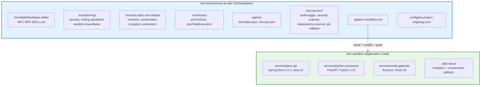
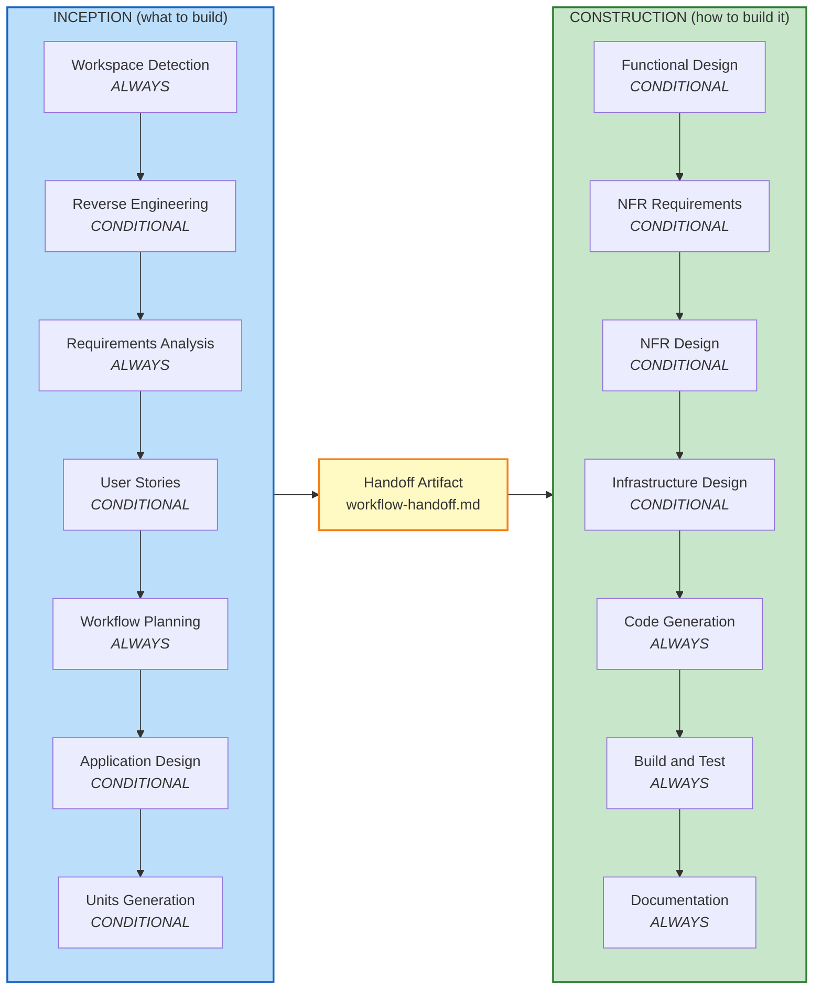
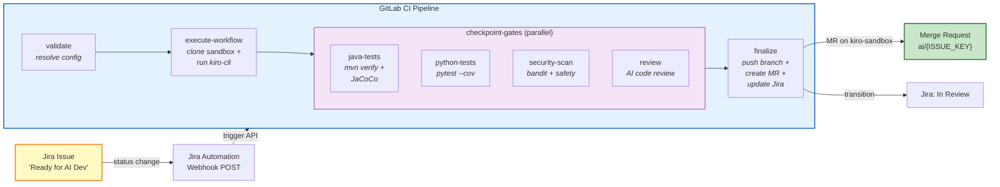
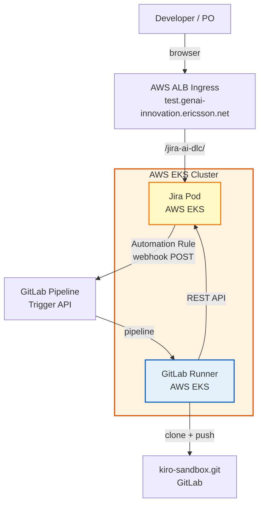
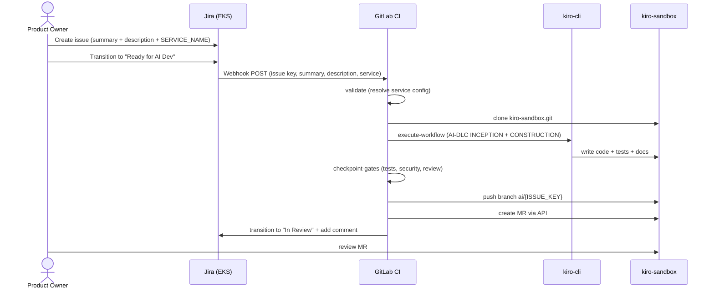

# Mandate Progress Report: Autonomous AI Software Development Lifecycle Prototype

**Document:** Progress Report — Week 3 (Kiro Native Migration + AI-DLC Integration + CI/CD Pipeline)
**Date:** 2026-03-31
**Reference:** Mandate — Autonomous AI Software Development Lifecycle Prototype

---

## Executive Summary

Week 3 delivered the migration from the custom AgentCore engine to Kiro-native primitives with AI-DLC (AI-Driven Development Lifecycle) integration. The system now operates as a two-repository architecture: `kiro-autonomous-ai-sdlc` (orchestration) and `kiro-sandbox` (application code). A dedicated Jira instance was deployed to AWS EKS at [https://test.genai-innovation.ericsson.net/jira-ai-dlc/](https://test.genai-innovation.ericsson.net/jira-ai-dlc/) to serve as the issue tracking frontend. A Jira Automation rule triggers a GitLab CI pipeline that executes the full AI-DLC lifecycle — from a Jira ticket to a merge request with tested, documented code — using `kiro-cli` in headless mode. The pipeline has been validated end-to-end with successful MR creation on the sandbox repository.

---

## 1. Week 3 Deliverables Overview

| # | Deliverable | Status | Evidence |
|---|---|---|---|
| 1 | Kiro Native Migration — AgentCore → Kiro Primitives | ✅ DELIVERED | Skills, Steering, Hooks, Agent configs, MCP servers |
| 2 | AI-DLC Integration — INCEPTION + CONSTRUCTION phases | ✅ DELIVERED | Rule details, WF1-WF4 skill loading, verbosity mode |
| 3 | Jira-GitLab-Kiro CI Pipeline | ✅ DELIVERED | `.gitlab-ci-workflow.yml`, end-to-end validated |
| 4 | Sandbox Repository Architecture | ✅ DELIVERED | Clone → modify → push → MR on kiro-sandbox |
| 5 | CI Runner Image (multi-language) | ✅ DELIVERED | `docker/kiro-ci/Dockerfile` (Python 3.12 + JDK 21 + Node 20) |
| 6 | MR Creation via GitLab API | ✅ DELIVERED | HTTP 201, MR !18 on kiro-sandbox |
| 7 | WF1-WF4 Rule Details Loading | ✅ DELIVERED | Shared rules from `.kiro/aws-aidlc-rule-details/` |
| 8 | Verbosity Mode (silent/debug) | ✅ DELIVERED | `common/verbosity-mode.md`, `aidlc-state.md` config |
| 9 | Documentation Update | ✅ DELIVERED | README.md rewritten with quick start guide |
| 10 | Jira Instance on AWS EKS | ✅ DELIVERED | [https://test.genai-innovation.ericsson.net/jira-ai-dlc/](https://test.genai-innovation.ericsson.net/jira-ai-dlc/) |

---

## 2. Kiro Native Migration — Architecture

### 2.1 Why Migrate

The Week 1-2 prototype used a custom `AgentCore` engine (Python workflow orchestrator, YAML step definitions, `LLMBackend` protocol, Strands SDK adapter). While functional, it required maintaining a custom runtime, custom step execution, and custom tool integration.

Kiro provides native equivalents for every AgentCore component:

| AgentCore Component | Kiro Native Equivalent | Benefit |
|---|---|---|
| YAML workflow steps | Skills (SKILL.md) | Declarative, version-controlled, shareable |
| `guardrails/*.yaml` | Steering files (.md) | Always-on, fileMatch, or manual inclusion |
| Custom triggers | Hooks (JSON) | Event-driven: fileEdited, preToolUse, postTaskExecution |
| `agents/*.json` (custom) | Agent configs (native) | Built-in routing, MCP server binding |
| Custom `LLMClient` | kiro-cli + Kiro IDE | No custom LLM integration needed |
| Custom tool functions | MCP servers | Standard protocol, stdio transport |
| Custom CI integration | kiro-cli `--no-interactive` | Headless execution in GitLab CI |

### 2.2 Two-Repository Architecture



### 2.3 Kiro Primitive Mapping (Final)

| Kiro Primitive | Files | SDLC Role |
|---|---|---|
| Skills | `.kiro/skills/developer-skills/wf{1-5}/SKILL.md` | Workflow definitions (requirement-to-software, refactoring, deps, bug fix, docs) |
| Steering | `.kiro/steering/*.md` | Always-on guardrails (security, coding standards, sandbox boundaries) + fileMatch (java, python, nodejs) |
| Hooks | `.kiro/hooks/*.json` | preToolUse checkpoint guard, postTaskExecution test runner |
| Agent configs | `agents/developer.json`, `agents/devops.json` | Role-based routing with MCP server bindings |
| MCP servers | `mcp-servers/{audit-logger,security-scanner,dependency-scanner,git-rollback}/` | Infrastructure tooling via stdio |
| Rule details | `.kiro/aws-aidlc-rule-details/` | AI-DLC phase rules loaded by WF skills |

---

## 3. AI-DLC Integration

### 3.1 What Is AI-DLC

AI-DLC (AI-Driven Development Lifecycle) is a structured two-phase process that adapts to request complexity:



INCEPTION analyzes the request, gathers requirements, and selects the appropriate workflow (WF1-WF5). It produces a Handoff Artifact that CONSTRUCTION consumes. CONSTRUCTION is delegated to the selected WF skill.

### 3.2 WF1-WF4 Rule Details Loading

Each WF skill now loads shared rules from `.kiro/aws-aidlc-rule-details/` at startup:

| Rule File | Purpose |
|---|---|
| `common/verbosity-mode.md` | Silent/debug output control |
| `common/error-handling.md` | Error severity, recovery, escalation |
| `common/overconfidence-prevention.md` | Default to asking questions, never assume |
| `common/content-validation.md` | Validate content before writing files |
| `common/depth-levels.md` | Adapt artifact detail to complexity |
| `construction/code-generation.md` | Code location rules, brownfield modification, automation-friendly code |
| `construction/build-and-test.md` | Test strategy, instruction formats |
| `extensions/security/baseline/security-baseline.md` | 15 SECURITY rules (conditional on Extension Configuration) |

This ensures consistent behavior across all workflows — same error handling, same security enforcement, same code generation rules.

### 3.3 Verbosity Mode

Added `silent` and `debug` output modes to reduce noise in CI:

- `silent` — Suppresses welcome message, phase diagrams, stage announcements, plan details. Only shows questions, approvals, errors, and results.
- `debug` — Full output (default for interactive use).

Configured in `aidlc-docs/aidlc-state.md` under `## Verbosity Mode`. Switchable at any time.

---

## 4. Jira-GitLab-Kiro CI Pipeline

### 4.1 Pipeline Architecture



### 4.2 Pipeline Stages

| Stage | Image | What It Does |
|---|---|---|
| `validate` | kiro-ci | Resolves Jira project key → service → workflow → coverage threshold |
| `execute-workflow` | kiro-ci | Clones kiro-sandbox, runs AI-DLC (INCEPTION + CONSTRUCTION) via kiro-cli |
| `checkpoint-gates:java-tests` | maven:3.9-eclipse-temurin-21 | `mvn verify` + JaCoCo coverage (skips if no pom.xml) |
| `checkpoint-gates:python-tests` | python:3.12-slim | `pytest --cov` with per-file coverage on changed code |
| `checkpoint-gates:security-scan` | python:3.12-slim | `bandit` + `safety` (blocks on HIGH/CRITICAL) |
| `checkpoint-gates:review` | kiro-ci | AI-assisted code review via kiro-cli |
| `finalize` | kiro-ci | Push branch, create MR via GitLab API, transition Jira |
| `on-failure` | kiro-ci | Transition Jira to "AI Dev Failed" on any stage failure |

### 4.3 Key Implementation Details

- kiro-cli runs inside `sandbox/` (the cloned kiro-sandbox repo) so all file writes land in the correct repository
- `aidlc-docs/` artifacts are committed alongside service code changes
- Clone uses `oauth2:${GL_TOKEN}` authentication with fallback chain
- MR creation handles HTTP 409 (existing MR) by fetching the existing MR URL
- Commit messages use conventional format: `feat({ISSUE_KEY}): {summary}`
- `scripts/retry-wrapper.sh` provides 3-retry exponential backoff for kiro-cli resilience

### 4.4 Service Configuration

`config/jira-project-mappings.yml` maps Jira projects to sandbox services:

```yaml
sandbox_repo: https://gitlab.internal.ericsson.com/.../kiro-sandbox.git

projects:
  QWE:
    default_service: java-api
    services:
      java-api:
        repo_path: services/java-api
        target_branch: main
      python-processor:
        repo_path: services/python-processor
        target_branch: main
      node-gateway:
        repo_path: services/node-gateway
        target_branch: main
```

The `SERVICE_NAME` Jira custom field drives service selection. Falls back to `default_service` if empty.

### 4.5 CI Runner Image

`docker/kiro-ci/Dockerfile` — multi-language image:

| Component | Version | Purpose |
|---|---|---|
| Python | 3.12 | kiro-cli, MCP servers, bandit, safety, pytest |
| OpenJDK | 21 | Java service compilation and testing |
| Maven | 3.9 | Java build tool |
| Node.js | 20 LTS | Node service compilation and testing |
| kiro-cli | latest | AI workflow execution |

### 4.6 Jira Automation Rule

**Trigger:** Issue transitioned → To status: "Ready for AI Dev"

**Action:** Send web request (POST, `application/x-www-form-urlencoded`):

```
URL: https://gitlab.internal.ericsson.com/api/v4/projects/115173/trigger/pipeline

Body:
token=<TOKEN>&ref=feat/kiro-autonomous-ai-sdlc-cicd
&variables[JIRA_ISSUE_KEY]={{issue.key}}
&variables[JIRA_SUMMARY]={{issue.summary}}
&variables[JIRA_DESCRIPTION]={{issue.description}}
&variables[JIRA_PROJECT_KEY]={{issue.project.key}}
&variables[SERVICE_NAME]={{issue.SERVICE_NAME}}
```

---

## 5. Jira Instance — AWS EKS Deployment

### 5.1 Overview

A dedicated Jira instance was provisioned on AWS EKS to serve as the issue tracking frontend for the AI-DLC pipeline.

**URL:** [https://test.genai-innovation.ericsson.net/jira-ai-dlc/](https://test.genai-innovation.ericsson.net/jira-ai-dlc/)

### 5.2 Deployment Architecture



### 5.3 Configuration

| Component | Detail |
|---|---|
| Platform | AWS EKS (Kubernetes) |
| URL | `https://test.genai-innovation.ericsson.net/jira-ai-dlc/` |
| Project Key | `QWE` |
| Custom Fields | `SERVICE_NAME` (multi-select — `java-api`, `python-processor`, `node-gateway`) |
| Automation Rule | Issue transition → "Ready for AI Dev" → POST to GitLab trigger API |
| Workflow Statuses | To Do → Ready for AI Dev → In Review → Done |

### 5.4 End-to-End Flow



---

## 6. Validation Results

### 5.1 End-to-End Pipeline Runs

| Run | Issue | Service | Result | MR |
|---|---|---|---|---|
| Pipeline 7428771 | QWE-3 | java-api | ✅ Push succeeded, MR 409 (existing) | !16 |
| Pipeline 7428934 | QWE-1 | python-processor | ✅ Full E2E: code + tests + docs + MR | !18 |
| Pipeline 7429xxx | QWE-1 | java-api | ✅ Full E2E after default_service fix | !18 (updated) |

### 5.2 What the Pipeline Produces

For each run, the pipeline generates:

**In the sandbox repo (committed to `ai/{ISSUE_KEY}` branch):**
- Modified service code (controller, service, models, tests)
- `aidlc-docs/` — Full AI-DLC artifact trail (state, audit, requirements, reverse engineering, handoff, code gen plan, build instructions)
- `services/{service}/docs/` — Release notes, CHANGELOG, OpenAPI spec, architecture diagram

**In GitLab:**
- Merge request on kiro-sandbox with conventional commit message
- JaCoCo/pytest coverage reports as CI artifacts
- Security scan results (bandit + safety)
- AI code review results

**In Jira:**
- Issue transitioned to "In Review" (if transition exists)
- Comment with pipeline URL, MR link, workflow ID

**In audit-logger MCP:**
- `workflow_start`, `inception_complete`, `construction_start`, `code-generation`, `security-scan`, `workflow_end` events
- SHA-256 hash chain for tamper evidence

---

## 7. Comparison: AgentCore vs Kiro Native

```mermaid
graph LR
    subgraph BEFORE["AgentCore (Week 1-2)"]
        direction TB
        B1["Custom WorkflowEngine<br/>~5,000 lines Python"]
        B2["YAML step definitions"]
        B3["LLMBackend protocol<br/>+ Strands adapter"]
        B4["@tool Python functions"]
        B5["Custom CostEstimator<br/>+ BudgetEnforcer"]
        B6["Custom webhook handler"]
    end

    subgraph AFTER["Kiro Native (Week 3)"]
        direction TB
        A1["kiro-cli<br/>zero custom engine"]
        A2["SKILL.md files"]
        A3["Built-in LLM<br/>(no adapter needed)"]
        A4["MCP servers (stdio)"]
        A5["Kiro-managed<br/>(no custom code)"]
        A6["Jira Automation<br/>+ GitLab triggers"]
    end

    BEFORE -->|"migration"| AFTER

    style BEFORE fill:#ffcdd2,stroke:#c62828,stroke-width:2px
    style AFTER fill:#c8e6c9,stroke:#2e7d32,stroke-width:2px
```



| Dimension | AgentCore (Week 1-2) | Kiro Native (Week 3) |
|---|---|---|
| Workflow definition | Custom YAML steps | SKILL.md files |
| Guardrails | `guardrails/*.yaml` | Steering files (.md) |
| Triggers | Custom webhook handler | Hooks (JSON) + Jira Automation |
| LLM integration | Custom `LLMClient` + Strands adapter | kiro-cli (built-in) |
| Tool integration | `@tool` decorated Python functions | MCP servers (stdio) |
| CI execution | Custom `agentcore run` in CI | `kiro-cli chat --no-interactive` |
| Multi-agent | Custom supervisor/swarm | Kiro agent configs |
| Cost control | Custom `CostEstimator`, `BudgetEnforcer` | Kiro-managed (no custom code) |
| Infrastructure | Custom runtime, memory, identity | Zero custom infrastructure |
| Lines of custom code | ~5,000+ (engine + backends + tools) | ~0 (pipeline YAML + config only) |

The migration eliminated the custom engine entirely. All workflow logic lives in declarative Kiro primitives (skills, steering, hooks) and the GitLab CI pipeline YAML.

---

## 8. Issues Resolved This Week

| # | Issue | Resolution |
|---|---|---|
| 1 | No JVM in CI runner image | Added OpenJDK 21 + Maven + Node.js 20 to `docker/kiro-ci/Dockerfile` |
| 2 | kiro-cli writing to CI repo root instead of sandbox | `cd sandbox` before kiro-cli execution |
| 3 | Broken token loop in clone-sandbox (`eval echo`) | Replaced with direct `for TOKEN_VAL in "${GL_TOKEN:-}"...` iteration |
| 4 | MR creation returning empty `{}` | Switched from `--form` to JSON body via Python subprocess |
| 5 | YAML parse errors from markdown in block scalars | Moved MR description to `printf` + temp file, indented commit messages |
| 6 | Missing agent configs in CI (`product-owner.json`) | Removed from `setup-kiro.sh` expected list (CI-only agents) |
| 7 | `JAVA_IMAGE` using Java 17 instead of 21 | Updated to `maven:3.9-eclipse-temurin-21` |
| 8 | `$HOME` undefined in Dockerfile ENV | Replaced with literal `/root/.local/bin` |
| 9 | Wrong default_service for Java tickets | Changed to `java-api` in `jira-project-mappings.yml` |
| 10 | HTTP 409 on MR creation (existing MR) | Added 409 handler that fetches existing MR URL |

---

## 9. Known Issues

| # | Issue | Severity | Status |
|---|---|---|---|
| 1 | Jira "In Review" transition not found (no matching status) | Low | Open — depends on Jira workflow config |
| 2 | `sandbox/workflow-output/` artifact path warning | Low | Resolved — removed stale path |
| 3 | kiro-cli MCP server duplicate warnings in CI | Low | ✅ Resolved — removed duplicate MCP servers from agent configs; now defined only in `.kiro/settings/mcp.json` |
| 4 | kiro-cli authenticated with personal user account | Medium | Open — service account needed for stable CI testing; personal token will expire and is not auditable as a CI identity |

---

## 10. Week 4 Updates (2026-04-09)

The following improvements were delivered after the initial Week 3 report:

### 10.1 New Deliverables

| # | Deliverable | Status | Evidence |
|---|---|---|---|
| 11 | FinOps Cost Estimator MCP Server | ✅ DELIVERED | `mcp-servers/finops-cost-estimator/server.py`, 5 cost dimensions |
| 12 | Node.js Checkpoint Gate | ✅ DELIVERED | `checkpoint-gates:node-tests` — `npm test` + Jest coverage |
| 13 | Multi-Service Mode (`all-services`) | ✅ DELIVERED | `SERVICE_NAME=all-services` inspects all 3 services in one run |
| 14 | WF1 Summary Report | ✅ DELIVERED | `docs/wf1-summary-{ISSUE_KEY}.md` generated per service |
| 15 | LLM Token Cost Extraction | ✅ DELIVERED | `scripts/extract_token_usage.py` + compute-time estimation fallback |
| 16 | Rate-Limit Aware Retry | ✅ DELIVERED | `retry-wrapper.sh` — 5 retries, 60s cooldown on rate limit |
| 17 | Mandatory WF1 Documentation | ✅ DELIVERED | 5 doc artifacts per service (release notes, CHANGELOG, OpenAPI, architecture, summary) |
| 18 | Sandbox Local Run + CI Deploy Docs | ✅ DELIVERED | README Step 5, `docker compose up --build`, CI deploy pipeline |

### 10.2 Pipeline Updates

| Change | Detail |
|---|---|
| `checkpoint-gates:node-tests` added | `npm test` + Jest coverage, skips if no `package.json` |
| `python-tests` multi-service aware | Iterates per Python service when `all-services` selected |
| `KIRO_LOG_LEVEL=trace` in CI | Enables token count extraction from kiro-cli logs |
| `extract_token_usage.py` post-kiro-cli | Injects LLM token counts into audit NDJSON before cost calculation |
| `audit/` added to pipeline artifacts | Token data persists across stages |
| `retry-wrapper.sh` improved | 5 retries (was 3), rate-limit detection (60s cooldown), 300s cap |

### 10.3 MCP Server Updates

| Server | Change |
|---|---|
| `finops-cost-estimator` (NEW) | 4 tools: `estimate_workflow_cost`, `calculate_workflow_cost`, `get_cost_report`, `get_historical_baseline` |
| Agent configs (all) | Removed duplicate MCP server definitions — now only in `mcp.json` via `setup-kiro.sh` |
| `setup-kiro.sh` | Docker transport for local, stdio for CI; venv python detection |

### 10.4 Configuration Updates

| Change | Detail |
|---|---|
| `workflow: auto` default | AI-DLC classifier selects WF at runtime (was hardcoded `wf1`) |
| `all-services` service entry | `repo_path: services` — inspects all 3 services in one pipeline run |
| `finops-cost-model.yml` | Unit prices + compute-time token estimation rates (configurable) |
| `finops-cost-reporting.md` steering | Always-on — mandates cost table in every workflow response |

### 10.5 Validated E2E Runs (Week 4)

| Run | Issue | Service | Result | Cost |
|---|---|---|---|---|
| Pipeline (QWE-11) | QWE-11 | python-processor | ✅ Config endpoints + 26 tests, 100% coverage | $0.03 |
| Pipeline (QWE-12) | QWE-12 | all-services | ✅ Config endpoints across 3 services, 34 tests | $0.34 |

### 10.6 Known Issues Updated

| # | Issue | Severity | Status |
|---|---|---|---|
| 1 | Jira "In Review" transition not found | Low | Open — depends on Jira workflow config |
| 4 | Personal kiro-cli token in CI | Medium | Open — service account needed |
| 5 | Docker MCP images stale after code changes | Medium | Open — must rebuild locally after server.py changes |
| 6 | LLM token counts are estimated, not exact | Low | Mitigated — compute-time estimation (~40 tok/s) used when kiro-cli log unavailable |

### 10.8 Sandbox CI/CD — Container and Helm Delivery to AWS

Each service in `kiro-sandbox` has its own `.gitlab-ci.yml` that triggers automatically when files in its directory change on push. The pipeline delivers container images and Helm charts to AWS ECR, with deployment to EKS via GitOps.

**Pipeline stages (per service):**

| Stage | Job | Description |
|---|---|---|
| version | `version` | `main`: semantic-release computes next semver (e.g. `1.0.3`). Other branches: `{base-version}-{commit-hash}` (e.g. `1.0.2-7a1946f1`) |
| build | `build container` | Kaniko builds the container image and pushes to Artifactory |
| publish | `publish container ECR` | Copies the image from Artifactory to AWS ECR with the release version tag |
| publish | `create helm chart` | Packages the Helm chart with the release version and pushes to the Helm repo |
| publish | `helm publish ECR` | Pushes the Helm chart to the ECR-based OCI Helm registry |
| release | `release` | On `main`: semantic-release creates a Git tag, updates `CHANGELOG.md` and `.version`, publishes a GitLab release |

**GitOps deployment flow:**

```
merge to main → semantic-release (v1.0.3)
  → Kaniko build → Artifactory
  → publish to ECR (container + Helm chart)
  → ArgoCD / Flux detects new chart version in ECR
  → deploys to AWS EKS cluster
```

| Component | Registry | Path |
|---|---|---|
| Container image | AWS ECR | `905418281081.dkr.ecr.us-east-1.amazonaws.com/python-processor:1.0.3` |
| Helm chart | AWS ECR (OCI) | `905418281081.dkr.ecr.us-east-1.amazonaws.com/helm/python-processor:1.0.3` |

**Branch strategy:**
- `main` → production release (semver tag, GitLab release, ECR push)
- Any other branch → pre-release build (`{version}-{hash}`, ECR push, no Git tag)

No manual steps needed. The same pattern applies to all three services (`java-api`, `python-processor`, `node-gateway`).

### 10.9 Live Deployment — Python Processor

The python-processor service is deployed to AWS EKS via the CI pipeline described above. The FastAPI Swagger UI is accessible at:

> **URL:** [https://test.genai-innovation.ericsson.net/python-processor/docs](https://test.genai-innovation.ericsson.net/python-processor/docs)

This is the live instance of the AI-generated code — endpoints like `GET /api/config`, `PUT /api/config/log-level`, `POST /api/process/users`, and `POST /api/reports/generate` are all reachable and documented via the interactive Swagger UI. Each merge to `main` in kiro-sandbox triggers the CI pipeline, which builds a new container image, pushes it to ECR, and the GitOps workflow deploys it to EKS automatically.

---

## 11. Conclusion

Week 3 completed the migration from the custom AgentCore engine to Kiro-native primitives with AI-DLC integration. Week 4 extended the system with FinOps cost tracking, multi-service support (`all-services`), Node.js checkpoint gates, mandatory WF1 documentation artifacts, and rate-limit-aware retry logic. The system now operates as a zero-custom-engine architecture with 5 MCP servers, 5 checkpoint gates (Java, Python, Node, security, review), and per-run cost reporting across 5 dimensions. End-to-end validated with multi-service runs producing tested code, documentation, and cost reports across all three sandbox services.
